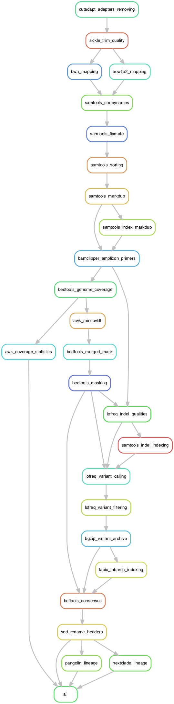
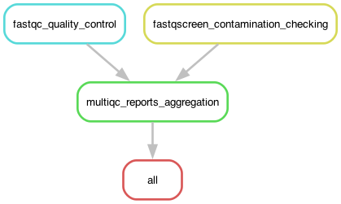
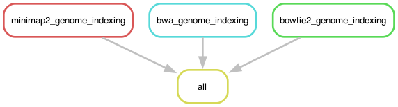

# GeVarLi: GEnome assembly, VARiant calling and LIneage assignation #


 | Catalina (10.15.7) | Big Sure (11.6.3) | Monterey (12.6.0) | Ventura (13.2.1)/E6055C?icon=apple&label&list=|&scale=0.9>)
 | Focal Fossa (20.04) | Jammy Jellyfish (22.04)/772953?icon=https://www.svgrepo.com/show/25424/ubuntu-logo.svg&label&list=|&scale=0.9>)
 | Focal Fossa (20.04) | Jammy Jellyfish (22.04)/00BCF2?icon=windows&label&list=|&scale=0.9>)


## ~ ABOUT ~ ##

### GeVarLi ###

GeVarLi	is a FAIR, open-source, scalable, modulable and traceable snakemake pipeline, used for SARS-CoV-2 (and others viruses) genome assembly and variants monitoring, using Illumina Inc. short reads COVIDSeq&trade; libraries sequencing.  
GeVarLi was initialy developed for **[AFROSCREEN](https://www.afroscreen.org/)** project. 

### Genomic sequencing, a public health tool ###

The establishment of a surveillance and sequencing network is an essential public health tool for detecting and containing pathogens with epidemic potential. Genomic sequencing makes it possible to identify pathogens, monitor the emergence and impact of variants, and adapt public health policies accordingly.

The Covid-19 epidemic has highlighted the disparities that remain between continents in terms of surveillance and sequencing systems. At the end of October 2021, of the 4,600,000 sequences shared on the public and free GISAID tool worldwide, only 49,000 came from the African continent, i.e. less than 1% of the cases of Covid-19 diagnosed on this continent.

### Features ###

- Reads quality control
  - Fastq-Screen (_contamination check_)
  - FastQC (_quality metrics_)
  - MultiQC (_html reports_)
- Reads cleaning
  - Cutadapt (_adapters trimming_)
  - Sickle-trim (_quality trimming_)
- Reads mapping
  - (_bam files_)
  - 
  - 
- Variants calling 
  - (_vcf files_)
- Genome coverage (_statistics reports_)
- Consensus sequences (_fasta file_)
- Genomes classification
  - Nextclade
  - Pangolin


### Version ###

*V.2023.03*  

### Rulegraph ###

  
  
  


## ~ SUPPORT ~ ##

1. Read The Fabulous Manual!
2. Read de Awsome Wiki!
3. Create a new issue: Issues > New issue > Describe your issue
4. Send an email to [nicolas.fernandez@ird.fr](url)


## ~ CITATION ~ ##

If you use this pipeline, *please* cite this *GeVarLi*, GitLab IRDForge repository and authors:

GitLab IRDForge repository: [https://forge.ird.fr/transvihmi/nfernandez/GeVarLi](https://forge.ird.fr/transvihmi/nfernandez/GeVarLi)

GeVarLi, a FAIR, open-source, scalable, modulable and traceable snakemake pipeline,
for reference-based Genome assembly and Variants calling and Lineage assignment,
from SARS-CoV-2 to others (re)emergent viruses, Illumina short reads sequencing.

Nicolas FERNANDEZ NUÑEZ _(1)_  
_(1) UMI 233 - Recherches Translationnelles sur le VIH et les Maladies Infectieuses endémiques et émergentes (TransVIHMI), University of Montpellier (UM), French Institute of Health and Medical Research (INSERM), French National Research Institute for Sustainable Development (IRD)_


## ~ AUTHORS & ACKNOWLEDGMENTS ~ ##

- Nicolas Fernandez - IRD _(Developer and Maintener)_  
- Christelle Butel - IRD _(Reporter)_  
- Eddy Kinganda-Lusamaki - INRB _(Source)_  
- DALL•E mini - OpenAI [Git](https://github.com/borisdayma/dalle-mini) _(Repo. avatar)_  


## ~ LICENSE ~ ##

Licencied under [GPLv3](https://www.gnu.org/licenses/gpl-3.0.html)  
Intellectual property belongs to [IRD](https://www.ird.fr/) and authors.


## ~ ROADMAP ~ ##

- Publish GeVarLi paper !
- Add GisAid submision files generation
- Add MultiQC config template


## ~ PROJECT STATUS ~ ##

This project is **regularly update** and **actively maintened**  
However, you can be volunteer to step in as **developer** or **maintainer**  


## ~ CONTRIBUTING ~ ##

Open to contributions!

- Asking for update
- Proposing new feature
- Reporting issue
- Fixing issue
- Sharing code
- Citing tool


## ~ INSTALLATIONS ~ ##

### Conda _(mandatory)_ ###

GeVarLi use the usefull **Conda** environment manager  
So, if and only if, it's required _(Conda not already installed)_, please, first install **Conda**!  
 
Download and install your OS adapted version of [Latest Miniconda Installer](https://docs.conda.io/en/latest/miniconda.html#latest-miniconda-installer-links)  

e.g. for **MacOSX-64-bit** systems:  
```shell
curl https://repo.anaconda.com/miniconda/Miniconda3-latest-MacOSX-x86_64.sh -o ~/Miniconda3-latest-MacOSX-x86_64.sh && \
bash ~/Miniconda3-latest-MacOSX-x86_64.sh -b -p ~/miniconda3/ && \
rm -f ~/Miniconda3-latest-MacOSX-x86_64.sh && \
~/miniconda3/condabin/conda update conda --yes && \
~/miniconda3/condabin/conda init && \
exit
```

e.g. for **Linux-64-bit** systems:  
```shell
curl https://repo.anaconda.com/miniconda/Miniconda3-latest-Linux-x86_64.sh -o ~/Miniconda3-latest-Linux-x86_64.sh && \
bash ~/Miniconda3-latest-Linux-x86_64.sh -b -p ~/miniconda3/ && \
rm -f ~/Miniconda3-latest-Linux-x86_64.sh && \
~/miniconda3/condabin/conda update conda --yes && \
~/miniconda3/condabin/conda init && \
exit
```

Update Conda:
```
conda update -n base -c defaults conda
```

### GeVarLi ###

Clone to your home/ [GeVarLi](https://forge.ird.fr/transvihmi/nfernandez/GeVarLi) GitLab IRDForge repository _(ID: 399)_:
```shell
git clone https://forge.ird.fr/transvihmi/GeVarLi.git ~/GeVarLi/
```

Update GeVarLi: 
```shell
cd ~/GeVarLi/ && git reset --hard HEAD && git pull --verbose
```

## ~ USAGE ~ ##

1. Copy your **paired-end** reads in **.fastq.gz** format files into: **./resources/reads/** directory
_SARS-CoV-2 sample reads are available for test into ./resources/test\_data/ directory_

2. Execute **Start_GeVarLi.sh** bash script to run GeVarLi pipeline _(according to your choice)_:
    - or with a **Double-click** on it _(if you make .sh files executable files with Terminal.app)_
	- or with a **Right-click** > **Open with** > **Terminal.app**
	- or with **CLI** from a terminal:
```shell
bash Start_GeVarLi.sh
```
3. Yours analyzes will start, with default configuration settings  

_Option-1: Edit **config.yaml** file in **./configuration/** directory_  
_Option-2: Edit **fastq-screen.conf** file in **./configuration/** directory_  

First run will auto-created _(only once)_:
	- Snakemake-Base conda environment _(Snakemake, Mamba, Rename, GraphViz)_
	- GeVarLi-conda environments _(tools used by GeVarLi)_
	- Indexes for BWA and BOWTIE2 aligners _(for each fasta genomes in resources)_
	
_This may take some time, depending on your internet connection and your computer_


## ~ RESULTS ~ ##

Yours results are available in **./results/** directory, as follow:  
_Some [temp] tagged files are removed by default, to save disk usage_

```shell
 🧩 GeVarLi/
  ├── 📂 archives/
  │    └── 📦 Results_{YYYY-MM-DD_HHhMM}_{REFERENCE}_{ALIGNER}_{MINCOV}_{SAMPLES}_archive.tar.gz
  └── 📂 results/
       ├── 🧬 All_consensus_sequences.fasta
       ├── 📊 All_genome_coverages.tsv
       ├── 📊 All_nextclade_lineages.tsv
       ├── 📊 All_pangolin_lineages.tsv
       ├── 🌐 All_readsQC_reports.html
       ├── 📂 00_Quality_Control/
       │    ├── 📂 fastq-screen/
       │    │    ├── 🌐 {SAMPLE}_R{1/2}_screen.html
       │    │    ├── 📈 {SAMPLE}_R{1/2}_screen.png
       │    │    └── 📄 {SAMPLE}_R{1/2}_screen.txt
       │    ├── 📂 fastqc/
       │    │    ├── 🌐 {SAMPLE}_R{1/2}_fastqc.html
       │    │    └── 📦 {SAMPLE}_R{1/2}_fastqc.zip
       │    └── 📂 multiqc/
       │         ├── 🌐 multiqc_report.html
       │         └──📂 multiqc_data/
       │             ├── 📝 multiqc.log
       │             ├── 📄 multiqc_citations.txt
       │             ├── 🌀 multiqc_data.json
       │             ├── 📄 multiqc_fastq_screen.txt
       │             ├── 📄 multiqc_fastqc.txt
       │             ├── 📄 multiqc_general_stats.txt
       |             └── 📄 multiqc_sources.txt
       ├── 📂 01_Trimmidapt
       │    ├── 📂 cutad{SAMPLE}_cutadapt-removed_R{1/2}.fastq.gz       # [temp]
       │    │    └── 📦 {S
       │    └── 📂 sickle/
       │         ├── 📦 {SAMPLE}_sickle-trimmed_R{1/2}.fastq.gz         # [temp]
       │         └── 📦 {SAMPLE}_sickle-trimmed_SE.fastq.gz             # [temp]
       ├── 📂 02_Mapping/
       │    ├── 🧭 {SAMPLE}_{ALIGNER}_mark-dup.bam
       │    ├── 🗂️  {SAMPLE}_{ALIGNER}_mark-dup.bam.bai
       │    ├── 🧭 {SAMPLE}_{ALIGNER}_mark-dup.primerclipped.bam
       │    ├── 🗂️  {SAMPLE}_{ALIGNER}_mark-dup.primerclipped.bam.bai
       │    ├── 🧭 {SAMPLE}_{ALIGNER}-mapped.sam                        # [temp]
       │    ├── 🧭 {SAMPLE}_{ALIGNER}_sorted-by-names.bam               # [temp]
       │    ├── 🧭 {SAMPLE}_{ALIGNER}_fixed-mate.bam                    # [temp]
       │    └── 🧭 {SAMPLE}_{ALIGNER}_sorted.bam                        # [temp]
       ├── 📂 03_Coverage/
       │    ├── 📊 {SAMPLE}_{ALIGNER}_{MINCOV}_coverage-stats.tsv
       │    ├── 🛏️  {SAMPLE}_{ALIGNER}_genome-cov.bed                    # [temp]
       │    ├── 🛏️  {SAMPLE}_{ALIGNER}_{MINCOV}_min-cov-filt.bed         # [temp]
       │    └── 🛏️  {SAMPLE}_{ALIGNER}_{MINCOV}_low-cov-mask.bed         # [temp]
       ├── 📂 04_Variants/
       │    ├── 🧬 {SAMPLE}_{ALIGNER}_{MINCOV}_masked-ref.fasta
       │    ├── 🗂️  {SAMPLE}_{ALIGNER}_{MINCOV}_masked-ref.fasta.fai
       │    ├── 🧭 {SAMPLE}_{ALIGNER}_{MINCOV}_indel-qual.bam
       │    ├── 🗂️  {SAMPLE}_{ALIGNER}_{MINCOV}_indel-qual.bai
       │    ├── 🧮️  {SAMPLE}_{ALIGNER}_{MINCOV}_variant-call.vcf
       │    ├── 🧮️  {SAMPLE}_{ALIGNER}_{MINCOV}_variant-filt.vcf
       │    ├── 📦 {SAMPLE}_{ALIGNER}_{MINCOV}_variant-filt.vcf.bgz     # [temp]
       │    └── 🗂️  {SAMPLE}_{ALIGNER}_{MINCOV}_variant-filt.vcf.bgz.tbi # [temp]
       ├── 📂 05_Consensus/
       │    └── 🧬 {SAMPLE}_{ALIGNER}_{MINCOV}_consensus.fasta
       ├── 📂 06_Lineages/
       │    ├── 📊 {SAMPLE}_{ALIGNER}_{MINCOV}_nextclade-report.tsv
       │    ├── 📊 {SAMPLE}_{ALIGNER}_{MINCOV}_pangolin-report.csv
       │    └── 📂 {SAMPLE}_{ALIGNER}_{MINCOV}_nextclade-all/
       │         ├── 🧬 nextclade.aligned.fasta
       │         ├── 📊 nextclade.csv
       │         ├── 📊 nextclade.errors.csv
       │         ├── 📊 nextclade.insertions.csv
       │         ├── 🌀 nextclade.json
       │         ├── 🌀 nextclade.ndjson
       │         ├── 🌀 nextclade.auspice.json
       │         └── 🧬 nextclade_{GENE}.translation.fasta
       └── 📂 10_Reports/
            ├── ⚙️  config.log
            ├── 📝 settings.log
            ├── 🍜 gevarli-base_v.{VERSION}.yaml
            ├── 🍜 gevarli-tools_v.{VERSION}.yaml
            ├── 📂 files-summaries
            │    └── 📄 {PIPELINE}_files-summary.txt
            ├── 📂 graphs/
            │    ├── 📈 {PIPELINE}_dag.{PNG/PDF}
            │    ├── 📈 {PIPELINE}_filegraph.{PNG/PDF}
            │    └── 📈 {PIPELINE}_rulegraph.{PNG/PDF}
            └── 📂 tools-log/
                 ├── 📂 awk/
                 ├── 📂 bcftools/
                 ├── 📂 bedtools/
                 ├── 📂 bgzip/
                 ├── 📂 bowtie2/
                 ├── 📂 bwa/
                 ├── 📂 cutadapt/
                 ├── 📂 lofreq/
                 ├── 📂 nextclade/
                 ├── 📂 pangolin/
                 ├── 📂 samtools/
                 ├── 📂 sed/
                 ├── 📂 sickle-trim/
                 ├── 📂 tabix/
                 ├── 📝 fastq-screen.log
                 ├── 📝 fastqc.log
                 └── 📝 multiqc.log
```

### Files Glossary ###

- **BAM**: Binary Alignment Map, compressed binary representation of the SAM files.
- **BAI**: BAM Indexes. 
- **FASTA**: Fast-All, text-based format for representing either nucleotide sequences or amino acid (protein) sequences.
- **FASTQ**: FASTA with Quality, text-based format storing both a biological sequence and its corresponding quality scores.
- **FAI**: FASTA Indexes. 
- **SAM**: Sequence Alignment Map, text-based format consists of a header and an alignment section.
- **YAML**: Commonly used for configuration filesand in applications where data is being stored or transmitted.
- **GZ**: format used for file compression and decompression, normally used to compress just single files.
- **TAR**: Tarball, format collecting many files into one archive file`, extract with ```tar -xzvf archive.tar.gz````.


## ~ CONFIGURATION ~ ##

You can edit default settings in **config.yaml** file into **./config/** directory:  


### Resources ###

Edit to match your hardware configuration  
- **cpus**: for tools that can _(i.e. bwa)_, could be use at most n cpus to run in parallel _(default config: '8')_  
_**Note**: snakemake (with default Start bash script) will always use all cpus to parallelize jobs_
- **ram**: for tools that can _(i.e. samtools)_, limit memory usage to max n Gb _(default config: '16' Gb)_
- **tmpdir**: for tools that can _(i.e. pangolin)_, specify where you want the temp stuff _(default config: '$TMPDIR')_


### Consensus ###

- **mincov**: minimum coverage for masking to low covered regions in final consensus sequence _(default: '30')_
- **minaf**: minimum allele frequency allowed for variant calling step _(default: '0.2')_
- **reference**: reference sequence fasta file format name used for mapping _(default: 'SARS-CoV-2\_Wuhan\_MN-908947-3')_
- **iupac**: allow output variants in the form of IUPAC ambiguity codes (default: deactivate -> '' )


### Aligner ###

- **aligner**: Map your reads using either **bwa** or **bowtie2**  


### Fastq-Screen ###

- **config**: path to the fastq-screen configuration file _(default: 'configuration/fastq-screen/' [*] )_
- **subset**: do not use the whole sequence file, but create a temporary dataset of this specified number of read _(default: '1000')_


#### [*] configuration/fastq-screen/{aligner}.conf ####

- **DATABASE**: (de)comment (#) or add your own 'DATABASE' to configure multiple genomes screaning


### Cutadapt ###

- **length**: discard reads shorter than length, after trimming _(default: '50')_
- **kits**: sequence of an adapter ligated to the 3' end of the first read _(default: 'truseq', 'nextera' and 'small' Illumina kits)  


### Sickle-trim ###

- **quality**: [Q-phred score](https://en.wikipedia.org/wiki/Phred_quality_score) limit _(default: '30')_
- **length**: read length limit, after trimming _(default: '50')_
- **command**: Pipeline wait for paired-end reads _(default and should be: 'pe')_
- **encoding**: If your data are from recent Illumina run, let 'sanger' _(default and should be: 'sanger')_


### BWA ###

- **path**: path to BWA indexes (default: 'resources/indexes/bwa/')
- **algorithm**: algorithm for constructing BWA index (default: deactivate -> '')


### Bowtie2 ###

- **sensitivity**: preset for bowtie2 sensitivity _(default config: '--sensitive')_
- **path**: path to Bowtie2 indexes (default: 'resources/indexes/bowtie2/')
- **algorithm**: algorithm for constructing Bowtie2 index (default: deactivate -> '' ) 


### Nextclade ###

- **path**: path to nextclade datasets
- **dataset**: Nextclade dataset (not used, set by Start\_GeVarLi.sh depending your reference genome)


### GisAid (soon) ###

- **username**:
- **threshold**:
- **name**:
- **country**:
- **identifier**:
- **year**:


### Environments ###

- **frontend**: conda frontend (default: 'mamba')
- **osx/linux**: conda environments paths/names for osx and linux OS (default: workflow/envs/{tools}\_v.{version}.yaml)
_**Note**: edit only if you want to change some environments (e.g. test a new version)_


### Operating System ###

- **osx**: Operating System (default: 'osx', but will set by Start\_GeVarLi.sh) 
_**Note**: Only 'osx' or 'linux' supported_


### GeVarLi map ###

```shell
 🧩 GeVarLi/
 ├── 🖥️️  Start_GeVarLi.sh
 ├── 📚 README.md
 ├── 🪪 LICENSE
 ├── 🛑 .gitignore
 ├── 📂 .git/
 ├── 📂 .snakemake/
 ├── 📂 configuration/
 │    ├── ⚙️  config.yaml
 │    ├── 📂 fastq-screen/
 │    │    ├── ⚙️  fastq-screen_bwa.conf
 │    │    └── ⚙️  fastq-screen_bowtie2.conf
 │    └── 📂 multiqc/
 │         └── ⚙️  default.yaml
 ├── 📂 resources/
 │    ├── 📂 genomes/
 │    │    ├── 🧬 SARS-CoV-2_Wuhan_MN-908947-3.fasta
 │    │    ├── 🧬 Monkeypox-virus_Zaire_AF-380138-1.fasta
 │    │    ├── 🧬 Monkeypox-virus_UK_MT-903345-1.fasta
 │    │    ├── 🧬 Swinepox-virus_India_MW-036632-1.fasta
 │    │    ├── 🧬 Ebola-virus_Zaire_AF-272001-1.fasta
 │    │    ├── 🧬 Ebola-virus_Sudan_MH-121162-1.fasta
 │    │    ├── 🧬 Nipah-virus_Malaysia_AJ-564622-1.fasta
 │    │    ├── 🧬 HIV-1_HXB2_K-03455-1.fasta
 │    │    ├── 🧬 (your_favorite_genome_reference}.fasta
 │    │    ├── 🧬 Echerichia-coli_CP-060121-1.fasta
 │    │    ├── 🧬 Kanamycin-Resistance-Gene.fasta
 │    │    ├── 🧬 NGS-adapters.fasta
 │    │    ├── 🧬 Phi-X174_Coliphage_NC-001422-1.fasta
 │    │    ├── 🧬 UniVec_wo_phiX-kanamycin-NGSseq.fasta
 │    │    └── 🧬 {your_favorite_control_reference}.fasta
 │    ├── 📂 indexes/
 │    │    ├── 📂 bwa/
 │    │    │    ├── 🗂️  {GENOME}.amb
 │    │    │    ├── 🗂️  {GENOME}.ann
 │    │    │    ├── 🗂️  {GENOME}.bwt
 │    │    │    ├── 🗂️  {GENOME}.pac
 │    │    │    └── 🗂️  {GENOME}.sa
 │    │    └── 📂 bowtie2/
 │    │         ├── 🗂️  {GENOME}.1.bt2
 │    │         ├── 🗂️  {GENOME}.2.bt2
 │    │         ├── 🗂️  {GENOME}.3.bt2
 │    │         ├── 🗂️  {GENOME}.4.bt2
 │    │         ├── 🗂️  {GENOME}.rev.1.bt2
 │    │         └── 🗂️  {GENOME}.rev.2.bt2
 │    ├── 📂 nextclade/
 │    │    ├── 📂 sars-cov-2/
 │    │    │    ├── 🌍 genemap.gff
 │    │    │    ├── 🧪 primers.csv
 │    │    │    ├── ✅ qc.json
 │    │    │    ├── 🦠 reference.fasta
 │    │    │    ├── 🧬 sequences.fasta
 │    │    │    ├── 🏷️  tag.json
 │    │    │    └── 🌳 tree.json
 │    │    ├── 📂 MPXV/
 │    │    │    ├── 🌍 genemap.gff
 │    │    │    ├── 🧪 primers.csv
 │    │    │    ├── ✅ qc.json
 │    │    │    ├── 🦠 reference.fasta
 │    │    │    ├── 🧬 sequences.fasta
 │    │    │    ├── 🏷️  tag.json
 │    │    │    └── 🌳 tree.json
 │    │    ├── 📂 hMPWV/
 │    │    │    ├── 🌍 genemap.gff
 │    │    │    ├── 🧪 primers.csv
 │    │    │    ├── ✅ qc.json
 │    │    │    ├── 🦠 reference.fasta
 │    │    │    ├── 🧬 sequences.fasta
 │    │    │    ├── 🏷️  tag.json
 │    │    │    └── 🌳 tree.json
 │    │    └── 📂 hMPXV_B1/
 │    │         ├── 🌍 genemap.gff
 │    │         ├── 🧪 primers.csv
 │    │         ├── ✅ qc.json
 │    │         ├── 🦠 reference.fasta
 │    │         ├── 🧬 sequences.fasta
 │    │         ├── 🏷️  tag.json
 │    │         └── 🌳 tree.json
 │    ├── 📂 primers/
 │    │    ├── 📂 bedpe/
 │    │    │    ├── 🛡️  .gitkeep
 │    │    │    ├── 🛌️  SARS-CoV-2_Wuhan_MN-908947-3_artic-primers-V1.bedpe
 │    │    │    ├── 🛌️  SARS-CoV-2_Wuhan_MN-908947-3_artic-primers-V2.bedpe
 │    │    │    ├── 🛌️  SARS-CoV-2_Wuhan_MN-908947-3_artic-primers-V3.bedpe
 │    │    │    ├── 🛌️  SARS-CoV-2_Wuhan_MN-908947-3_artic-primers-V4.bedpe
 │    │    │    ├── 🛌️  SARS-CoV-2_Wuhan_MN-908947-3_artic-primers-V4-1.bedpe
 │    │    │    ├── 🛌️  Ebola-virus_Zaire_KR-063671-1_artic-primers-V1.bedpe
 │    │    │    ├── 🛌️  Ebola-virus_Zaire_AF-272001-1_artic-primers-V2.bedpe
 │    │    │    ├── 🛌️  Ebola-virus_Zaire_KR-063671-1_artic-primers-V3.bedpe
 │    │    │    ├── 🛌️  Nipah-virus_Malaysia_AJ-564622-1_artic-primers-V1.bedpe
 │    │    │    └── 🛌️  {your_favorite_amplicon_kit_primers}.bedpe
 │    │    ├── 📂 bed/ (soon)
 │    │    │    ├── 🛡️  .gitkeep
 │    │    │    └── 🛏️  {your_favorite_kit_primers}.bed
 │    │    └── 📂 fasta/ (soon)
 │    │         ├── 🛡️  .gitkeep
 │    │         └── 🧬 {your_favorite_kit_primers}.fasta
 │    ├── 📂 reads/
 │    │    ├── 🛡️  .gitkeep
 │    │    ├── 📦 {SAMPLE}_R1.fastq.gz
 │    │    └── 📦 {SAMPLE}_R2.fastq.gz
 │    ├── 📂 test_data/
 │    │    ├── 🛡️  .gitkeep
 │    │    ├── 📦 SARS-CoV-2_Omicron-BA.1.1_Covid-Seq-Lib-on-MiSeq_250000-reads_R1.fastq.gz
 │    │    └── 📦 SARS-CoV-2_Omicron-BA.1.1_Covid-Seq-Lib-on-MiSeq_250000-reads_R2.fastq.gz
 │    └── 📂 visuals/
 │         ├── 📈 gevarli_rulegraph.png
 │         ├── 📈 indexing_genomes_rulegraph.png
 │         └── 📈 quality_control_rulegraph.png
 └── 📂 workflow/
      ├── 📂 environments/
      │    ├── 📂 linux/
      │    │    ├── 🍜 bamclipper_v.1.0.yaml
      │    │    ├── 🍜 bcftools_v.1.15.1.yaml
      │    │    ├── 🍜 bedtools_v.2.30.0.yaml
      │    │    ├── 🍜 bowtie2_v.2.4.5.yaml
      │    │    ├── 🍜 bwa_v.0.7.17.yaml
      │    │    ├── 🍜 cutadapt_v.4.1.yaml
      │    │    ├── 🍜 fastq-screen_v.0.15.2.yaml
      │    │    ├── 🍜 fastqc_v.0.11.9.yaml
      │    │    ├── 🍜 gawk_v.5.1.0.yaml
      │    │    ├── 🍜 gevarli-base_v.2022.11.yaml
      │    │    ├── 🍜 lofreq_v.2.1.5.yaml
      │    │    ├── 🍜 multiqc_v.1.13.yaml
      │    │    ├── 🍜 nextclade_v.2.9.1.yaml
      │    │    ├── 🍜 pangolin_v.4.1.3.yaml
      │    │    ├── 🍜 samtools_v.1.15.1.yaml
      │    │    └── 🍜 sickle-trim_v.1.33.yaml
      │    └── 📂 osx/
      │         ├── 🍜 bamclipper_v.1.0.yaml
      │         ├── 🍜 bcftools_v.1.15.1.yaml
      │         ├── 🍜 bedtools_v.2.30.0.yaml
      │         ├── 🍜 bowtie2_v.2.4.5.yaml
      │         ├── 🍜 bwa_v.0.7.17.yaml
      │         ├── 🍜 cutadapt_v.4.1.yaml
      │         ├── 🍜 fastq-screen_v.0.15.2.yaml
      │         ├── 🍜 fastqc_v.0.11.9.yaml
      │         ├── 🍜 gawk_v.5.1.0.yaml
      │         ├── 🍜 gevarli-base_v.2022.11.yaml
      │         ├── 🍜 lofreq_v.2.1.5.yaml
      │         ├── 🍜 multiqc_v.1.13.yaml
      │         ├── 🍜 nextclade_v.2.9.1.yaml
      │         ├── 🍜 pangolin_v.4.1.3.yaml
      │         ├── 🍜 samtools_v.1.15.1.yaml
      │         └── 🍜 sickle-trim_v.1.33.yaml
      └── 📂 snakefiles/
	       ├── 📜 gevarli.smk
	       ├── 📜 indexing_genomes.smk
	       └── 📜 quality_control.smk
```

## ~ REFERENCES ~ ##

**Sustainable data analysis with Snakemake**  
Felix Mölder, Kim Philipp Jablonski, Brice Letcher, Michael B. Hall, Christopher H. Tomkins-Tinch, Vanessa Sochat, Jan Forster, Soohyun Lee, Sven O. Twardziok, Alexander Kanitz, Andreas Wilm, Manuel Holtgrewe, Sven Rahmann, Sven Nahnsen, Johannes Köster  
_F1000Research (2021)_  
**DOI**: [https://doi.org/10.12688/f1000research.29032.2](https://doi.org/10.12688/f1000research.29032.2)  
**Publication**: [https://f1000research.com/articles/10-33/v1](https://f1000research.com/articles/10-33/v1)  
**Source code**: [https://github.com/snakemake/snakemake](https://github.com/snakemake/snakemake)  
**Documentation**: [https://snakemake.readthedocs.io/en/stable/index.html](https://snakemake.readthedocs.io/en/stable/index.html)  

**Anaconda Software Distribution**  
Team  
_Computer software (2016)_  
**DOI**: []()  
**Publication**: [https://www.anaconda.com](https://www.anaconda.com)  
**Source code**: [https://github.com/snakemake/snakemake](https://github.com/snakemake/snakemake) (conda)  
**Documentation**: [https://snakemake.readthedocs.io/en/stable/index.html](https://snakemake.readthedocs.io/en/stable/index.html) (conda)  
**Source code**: [https://github.com/mamba-org/mamba](https://github.com/mamba-org/mamba) (mamba) 
**Documentation**: [https://mamba.readthedocs.io/en/latest/index.html](https://mamba.readthedocs.io/en/latest/index.html) (mamba)  

**HAVoC, a bioinformatic pipeline for reference-based consensus assembly and lineage assignment for SARS-CoV-2 sequences**  
Phuoc Thien Truong Nguyen, Ilya Plyusnin, Tarja Sironen, Olli Vapalahti, Ravi Kant & Teemu Smura  
_BMC Bioinformatics volume 22, Article number: 373 (2021)_  
**DOI**: [https://doi.org/10.1186/s12859-021-04294-2](https://doi.org/10.1186/s12859-021-04294-2)  
**Publication**: [https://bmcbioinformatics.biomedcentral.com/articles/10.1186/s12859-021-04294-2#Bib1](https://bmcbioinformatics.biomedcentral.com/articles/10.1186/s12859-021-04294-2#Bib1)  
**Source code**: [https://bitbucket.org/auto_cov_pipeline/havoc](https://bitbucket.org/auto_cov_pipeline/havoc)  
**Documentation**: [https://www2.helsinki.fi/en/projects/havoc](https://www2.helsinki.fi/en/projects/havoc)  

**Nextclade: clade assignment, mutation calling and quality control for viral genomes**  
Ivan Aksamentov, Cornelius Roemer, Emma B. Hodcroft and Richard A. Neher  
_The Journal of Open Source Software_  
**DOI**: [https://doi.org/10.21105/joss.03773](https://doi.org/10.21105/joss.03773)  
**Publication**: [https://joss.theoj.org/papers/10.21105/joss.03773)(https://joss.theoj.org/papers/10.21105/joss.03773)  
**Source code**: [https://github.com/nextstrain/nextclade](https://github.com/nextstrain/nextclade)  
**Documentation**: [https://clades.nextstrain.org](https://clades.nextstrain.org)  

**Assignment of epidemiological lineages in an emerging pandemic using the pangolin tool**  
Áine O’Toole, Emily Scher, Anthony Underwood, Ben Jackson, Verity Hill, John T McCrone, Rachel Colquhoun, Chris Ruis, Khalil Abu-Dahab, Ben Taylor, Corin Yeats, Louis du Plessis, Daniel Maloney, Nathan Medd, Stephen W Attwood, David M Aanensen, Edward C Holmes, Oliver G Pybus and Andrew Rambaut  
_Virus Evolution, Volume 7, Issue 2 (2021)_  
**DOI**: [https://doi.org/10.1093/ve/veab064](https://doi.org/10.1093/ve/veab064)  
**Publication**: [https://academic.oup.com/ve/article/7/2/veab064/6315289](https://academic.oup.com/ve/article/7/2/veab064/6315289)  
**Source code**: [https://github.com/cov-lineages/pangolin](https://github.com/cov-lineages/pangolin) _(pangolin)_  
**Source code**: [https://github.com/cov-lineages/scorpio](https://github.com/cov-lineages/scorpio) _(scorpio)_  
**Documentation**: [https://cov-lineages.org/index.html](https://cov-lineages.org/index.html)  

**Tabix: fast retrieval of sequence features from generic TAB-delimited files**  
Heng Li  
_Bioinformatics, Volume 27, Issue 5 (2011)_  
**DOI**: [https://doi.org/10.1093/bioinformatics/btq671](https://doi.org/10.1093/bioinformatics/btq671)  
**Publication**: [https://www.ncbi.nlm.nih.gov/pmc/articles/PMC3042176/](https://www.ncbi.nlm.nih.gov/pmc/articles/PMC3042176/)  
**Source code**: [https://github.com/samtools/samtools](https://github.com/samtools/samtools)  
**Documentation**: [http://samtools.sourceforge.net](http://samtools.sourceforge.net)  

**LoFreq: a sequence-quality aware, ultra-sensitive variant caller for uncovering cell-population heterogeneity from high-throughput sequencing datasets**  
Andreas Wilm, Pauline Poh Kim Aw, Denis Bertrand, Grace Hui Ting Yeo, Swee Hoe Ong, Chang Hua Wong, Chiea Chuen Khor, Rosemary Petric, Martin Lloyd Hibberd and Niranjan Nagarajan  
_Nucleic Acids Research, Volume 40, Issue 22 (2012)_  
**DOI**: [https://doi.org/10.1093/nar/gks918](https://doi.org/10.1093/nar/gks918)  
**Publication**: [https://pubmed.ncbi.nlm.nih.gov/23066108/](https://pubmed.ncbi.nlm.nih.gov/23066108/)  
**Source code**: [https://gitlab.com/treangenlab/lofreq](https://gitlab.com/treangenlab/lofreq) _(v2 used)_  
**Source code**: [https://github.com/andreas-wilm/lofreq3](https://github.com/andreas-wilm/lofreq3) _(see also v3 in Nim)_  
**Documentation**: [https://csb5.github.io/lofreq](https://csb5.github.io/lofreq)  

**The AWK Programming Language**  
Al Aho, Brian Kernighan and Peter Weinberger  
_Addison-Wesley (1988)_  
**ISBN**: [https://www.biblio.com/9780201079814](https://www.biblio.com/9780201079814)  
**Publication**: []()  
**Source code**: [https://github.com/onetrueawk/awk](https://github.com/onetrueawk/awk)  
**Documentation**: [https://www.gnu.org/software/gawk/manual/gawk.html](https://www.gnu.org/software/gawk/manual/gawk.html)  

**BEDTools: a flexible suite of utilities for comparing genomic features**  
Aaron R. Quinlan and Ira M. Hall  
_Bioinformatics, Volume 26, Issue 6 (2010)_  
**DOI**: [https://doi.org/10.1093/bioinformatics/btq033](https://doi.org/10.1093/bioinformatics/btq033)  
**Publication**: [https://academic.oup.com/bioinformatics/article/26/6/841/244688](https://academic.oup.com/bioinformatics/article/26/6/841/244688)  
**Source code**: [https://github.com/arq5x/bedtools2](https://github.com/arq5x/bedtools2)  
**Documentation**: [https://bedtools.readthedocs.io/en/latest/](https://bedtools.readthedocs.io/en/latest/)  

**ARTIC Network**  
Authors
Journal (year)  
**DOI**: []()  
**Publication**: []()  
**Source code**: [https://github.com/artic-network/primer-schemes](https://github.com/artic-network/primer-schemes)
**Documentation**:

**BAMClipper: removing primers from alignments to minimize false-negative mutations in amplicon next-generation sequencing**  
Chun Hang Au, Dona N. Ho, Ava Kwong, Tsun Leung Chan and Edmond S. K. Ma 
Scientific Reports 7:1567 (2017)  
**DOI**: [https://doi.org/10.1038/s41598-017-01703-6](https://doi.org/10.1038/s41598-017-01703-6)
**Publication**: [https://www.nature.com/articles/s41598-017-01703-6](https://www.nature.com/articles/s41598-017-01703-6)
**Source code**: [https://github.com/tommyau/bamclipper](https://github.com/tommyau/bamclipper)
**Documentation**:

**Twelve years of SAMtools and BCFtools**  
Petr Danecek, James K Bonfield, Jennifer Liddle, John Marshall, Valeriu Ohan, Martin O Pollard, Andrew Whitwham, Thomas Keane, Shane A McCarthy, Robert M Davies and Heng Li  
_GigaScience, Volume 10, Issue 2 (2021)_  
**DOI**: [https://doi.org/10.1093/gigascience/giab008](https://doi.org/10.1093/gigascience/giab008)  
**Publication**: [https://academic.oup.com/gigascience/article/10/2/giab008/6137722](https://academic.oup.com/gigascience/article/10/2/giab008/6137722)  
**Source code**: [https://github.com/samtools/samtools](https://github.com/samtools/samtools)  
**Documentation**: [http://samtools.sourceforge.net](http://samtools.sourceforge.net)  

**Fast and accurate short read alignment with Burrows-Wheeler Transform**  
Heng Li and Richard Durbin  
_Bioinformatics, Volume 25, Aricle 1754-60 (2009)_  
**DOI**: [https://doi.org/10.1093/bioinformatics/btp324](https://doi.org/10.1093/bioinformatics/btp324)  
**Publication**: [https://pubmed.ncbi.nlm.nih.gov/19451168@](https://pubmed.ncbi.nlm.nih.gov/19451168)  
**Source code**: [https://github.com/lh3/bwa](https://github.com/lh3/bwa)  
**Documentation**: [http://bio-bwa.sourceforge.net](http://bio-bwa.sourceforge.net)  

**Sickle: A sliding-window, adaptive, quality-based trimming tool for FastQ files**  
Joshi NA and Fass JN  
_(2011)  
**DOI**: [https://doi.org/](https://doi.org/)  
**Publication**: []()  
**Source code**: [https://github.com/najoshi/sickle](https://github.com/najoshi/sickle)  
**Documentation**: []()  

**Cutadapt Removes Adapter Sequences From High-Throughput Sequencing Reads**  
Marcel Martin  
_EMBnet Journal, Volume 17, Article 1 (2011)  
**DOI**: [https://doi.org/10.14806/ej.17.1.200](https://doi.org/10.14806/ej.17.1.200)  
**Publication**: [http://journal.embnet.org/index.php/embnetjournal/article/view/200](http://journal.embnet.org/index.php/embnetjournal/article/view/200)  
**Source code**: [https://github.com/marcelm/cutadapt](https://github.com/marcelm/cutadapt)  
**Documentation**: [https://cutadapt.readthedocs.io/en/stable/](https://cutadapt.readthedocs.io/en/stable)  

**MultiQC: summarize analysis results for multiple tools and samples in a single report**  
Philip Ewels, Måns Magnusson, Sverker Lundin and Max Käller  
_Bioinformatics, Volume 32, Issue 19 (2016)_  
**DOI**: [https://doi.org/10.1093/bioinformatics/btw354](https://doi.org/10.1093/bioinformatics/btw354)  
**Publication**: [https://academic.oup.com/bioinformatics/article/32/19/3047/2196507](https://academic.oup.com/bioinformatics/article/32/19/3047/2196507)  
**Source code**: [https://github.com/ewels/MultiQC](https://github.com/ewels/MultiQC)  
**Documentation**: [https://multiqc.info](https://multiqc.info)  

**FastQ Screen: A tool for multi-genome mapping and quality control**  
Wingett SW and Andrews S  
_F1000Research (2018)_  
**DOI**: [https://doi.org/10.12688/f1000research.15931.2](https://doi.org/10.12688/f1000research.15931.2)  
**Publication**: [https://f1000research.com/articles/7-1338/v2](https://f1000research.com/articles/7-1338/v2)  
**Source code**: [https://github.com/StevenWingett/FastQ-Screen](https://github.com/StevenWingett/FastQ-Screen)  
**Documentation**: [https://www.bioinformatics.babraham.ac.uk/projects/fastq_screen](https://www.bioinformatics.babraham.ac.uk/projects/fastq_screen)  

**FastQC: A quality control tool for high throughput sequence data**  
Simon Andrews  
_Online (2010)_  
**DOI**: [https://doi.org/](https://doi.org/)  
**Publication**: []()  
**Source code**: [https://github.com/s-andrews/FastQC](https://github.com/s-andrews/FastQC)  
**Documentation**: [https://www.bioinformatics.babraham.ac.uk/projects/fastqc](https://www.bioinformatics.babraham.ac.uk/projects/fastqc)  

**Seqtk: A fast and lightweight tool for processing sequences in the FASTA or FASTQ format**  
Heng Li  
_Online (2014)_  
**DOI**: [https://doi.org/](https://doi.org/)  
**Publication**: []()  
**Source code**: [https://github.com/lh3/seqtk](https://github.com/lh3/seqtk)  
**Documentation**: [https://bioweb.pasteur.fr/packages/pack@seqtk@1.3](https://bioweb.pasteur.fr/packages/pack@seqtk@1.3)  


###############################################################################
