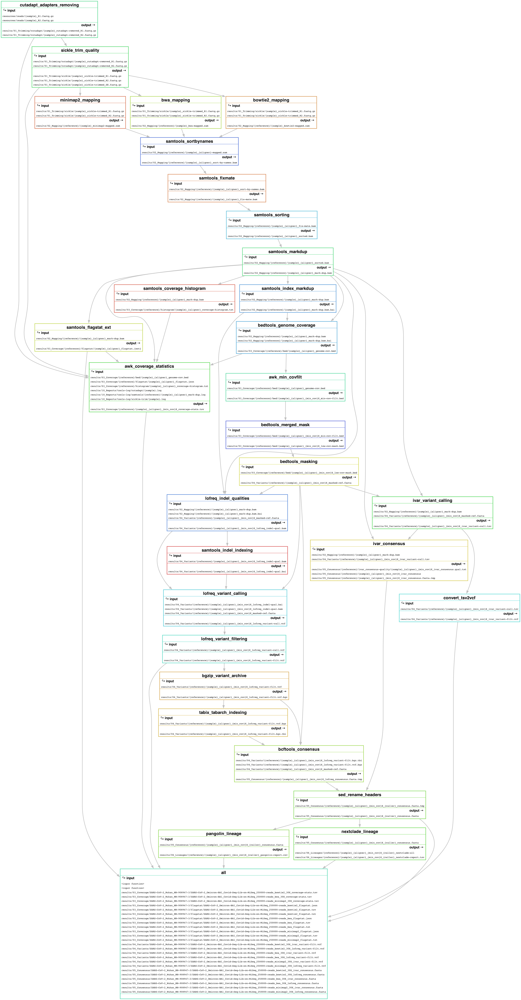

# GeVarLi: GEnome Assembly, VARiant calling and LIneage assignation #


 to 15.0 (Sequoia)/E6055C?icon=apple&label&list=|&scale=0.9>)
 to 24 (Noble Numbat)/772953?icon=https://www.svgrepo.com/show/25424/ubuntu-logo.svg&label&list=|&scale=0.9>)


## ~ ABOUT ~ ##

### GeVarLi ###

GeVarLi	is a FAIR, open-source, scalable, modulable and traceable snakemake pipeline, used for SARS-CoV-2 (and others viruses) genome assembly and variants monitoring, using Illumina Inc. short reads COVIDSeq&trade; libraries sequencing.  

GeVarLi was initialy developed in intern (Oct. 2021) for **[AFROSCREEN](https://www.afroscreen.org/)** project, before public release on GitLab (Mar. 2022).

### Genomic sequencing, a public health tool ###

The establishment of a surveillance and sequencing network is an essential public health tool for detecting and containing pathogens with epidemic potential. Genomic sequencing makes it possible to identify pathogens, monitor the emergence and impact of variants, and adapt public health policies accordingly.

The Covid-19 epidemic has highlighted the disparities that remain between continents in terms of surveillance and sequencing systems. At the end of October 2021, of the 4,600,000 sequences shared on the public and free GISAID tool worldwide, only 49,000 came from the African continent, i.e. less than 1% of the cases of Covid-19 diagnosed on this continent.

### Version ###

*v.2024.11*  

### Features ###

- Reads quality control
  - Fastq-Screen (_contamination check_)
  - FastQC (_quality metrics_)
  - MultiQC (_html reports_)
- Reads cleaning
  - Cutadapt (_adapters trimming & amplicon primers 'hard-clipping'_)
  - Sickle-trim (_quality trimming_)
- Reads mapping
  - Index genomes
  - BWA aligments (bowtie2 / minimap2 also available)
  - Bamclipper (_amplicon primers 'soft-clipping'_)
  - Visualization (_output bam and bed for IGV_)
  - Genome coverage (_statistics reports_)
- Variants calling
  - ivar (_filtering on qualities_)
- Consensus sequences (_ivar output fasta file_)
- Genomes classification
  - Nextclade (_consensus quality and lineages reports_)
  - Pangolin (_lineages reports_)

### Rulegraph ###

  


## ~ INSTALLATIONS ~ ##

### Conda ###
_(Dependency required)_

GeVarLi use the use the free and open-source package manager **Conda**.  
If you don't have Conda, it can be installed with **Miniforge**.

You can **download** and **install** it for your specific OS here: [Latest Miniforge installer](https://github.com/conda-forge/miniforge/releases) (≥ 24.9.2)  

Example script for **MacOSX_INTEL-chips_x86_64-bit** or **MacOSX_M1/M2-chips_arm_64-bit (with Rosetta)** systems:  
```shell
curl -L -O https://github.com/conda-forge/miniforge/releases/latest/download/Miniforge3-MacOSX-x86_64.sh
bash ./Miniforge3-MacOSX-x86_64.sh -b -p ~/miniforge3/
rm -f ./Miniforge3-MacOSX-x86_64.sh

~/miniforge3/condabin/conda init
shell=$(~/miniforge3/condabin/conda init 2> /dev/null | grep "modified" | sed 's/modified      //')
source ${shell}
```

Example script for **Linux_x86_64-bit** or **Windows Subsystem for Linux (WSL)** *systems:  
```shell
curl -L -O https://github.com/conda-forge/miniforge/releases/latest/download/Miniforge3-Linux-x86_64.sh
bash ./Miniforge3-Linux-x86_64.sh -b -p ~/miniforge3/
rm -f ./Miniforge3-Linux-x86_64.sh

~/miniforge3/condabin/conda init
shell=$(~/miniforge3/condabin/conda init 2> /dev/null | grep "modified" | sed 's/modified      //')
source ${shell}
```

We also higly recommand to **set channels** and **update** it !
Read: [Avoiding the Pitfalls of the Anaconda License](https://mivegec.pages.ird.fr/dainat/malbec-fix-conda-licensing-issues/en/)

Example script:
```shell  
~/miniforge3/condabin/conda config --add channels bioconda
~/miniforge3/condabin/conda config --add channels conda-forge
~/miniforge3/condabin/conda config --set channel_priority strict
~/miniforge3/condabin/conda config --set auto_activate_base false

~/miniforge3/condabin/conda update conda --yes

~/miniforge3/condabin/conda --version
~/miniforge3/condabin/conda config --show channels
```


### GeVarLi ###
_(Given that Conda is installed)_

You can just **download** [GeVarLi](https://forge.ird.fr/transvihmi/nfernandez/GeVarLi):

As a zip file:
  

Exemple script to **download** to your home/ directory:
```shell
curl https://forge.ird.fr/transvihmi/nfernandez/GeVarLi/-/archive/main/GeVarLi-main.tar.gz -o ~/GeVarLi-main.tar.gz
tar -xzvf ~/GeVarLi-main.tar.gz
mv ~/GeVarLi-main/ ~/GeVarLi/
rm -f ~/GeVarLi-main.tar.gz
```

Otherwise, you can **clone** and **update** [GeVarLi](https://forge.ird.fr/transvihmi/nfernandez/GeVarLi)

Exemple script to **clone** to your home/ directory:
```shell
git clone --depth 1 https://forge.ird.fr/transvihmi/nfernandez/GeVarLi.git ~/GeVarLi/
```

Exemple script to **update** through "git pull":
```shell
cd ~/GeVarLi/ && git reset --hard HEAD && git pull --depth 1 --verbose
```


## ~ USAGE ~ ##

### Quick start ###

To start your first analysis:

1. Copy your **paired-end** reads files, in **.fastq.gz** format, into: **./resources/reads/** directory
_Without reads, SARS-CoV-2 from ./resources/test\_data/ directory will be used_

2. Execute **Run_GeVarLi.sh** bash script to run GeVarLi pipeline:
    - or with a **Double-click** on it _(if you make .sh files executable files with Terminal.app)_
	- or with a **Right-click** > **Open with** > **Terminal.app**
	- or with **CLI** from a terminal:

Exemple script:
```shell
./Run_GeVarLi.sh
```

**NB**: If your reads were generated with an **amplicon protocol**,   
you will also need to provide the amplicon primer coordinates in **BEDPE** format,  
so the **primers are trimmed appropriately**.


3. Yours analyzes will start, with default configuration settings  

_Option-1: Edit **config.yaml** file in **./configuration/** directory_  
_Option-2: Edit **fastq-screen.conf** file in **./configuration/** directory_  


## ~ RESULTS ~ ##

Yours results are available in **./results/** directory, as follow:  
_Some [temp] tagged files are removed by default, to save disk usage_

```shell
 🧩 GeVarLi/
  └── 📂 results/
       ├── 🧬 All_{REFERENCE}_consensus_sequences.fasta
       ├── 📊 All_{REFERENCE}_genome_coverages.tsv
       ├── 📊 All_{REFERENCE}_nextclade_lineages.tsv
       ├── 📊 All_{REFERENCE}_pangolin_lineages.tsv
       ├── 🌐 All_readsQC_reports.html
       ├── 📂 00_Quality_Control/
       │    ├── 📂 fastq-screen/
       │    │    ├── 🌐 {SAMPLE}_R{1/2}_screen.html
       │    │    ├── 📈 {SAMPLE}_R{1/2}_screen.png
       │    │    └── 📄 {SAMPLE}_R{1/2}_screen.txt
       │    ├── 📂 fastqc/
       │    │    ├── 🌐 {SAMPLE}_R{1/2}_fastqc.html
       │    │    └── 📦 {SAMPLE}_R{1/2}_fastqc.zip
       │    └── 📂 multiqc/
       │         ├── 🌐 multiqc_report.html
       │         └──📂 multiqc_data/
       │             ├── 📝 multiqc.log
       │             ├── 📄 multiqc_citations.txt
       │             ├── 🌀 multiqc_data.json
       │             ├── 📄 multiqc_fastq_screen.txt
       │             ├── 📄 multiqc_fastqc.txt
       │             ├── 📄 multiqc_general_stats.txt
       |             └── 📄 multiqc_sources.txt
       ├── 📂 01_Trimmidapt
       │    ├── 📂 cutadapt/
       │    │    └── 📦 {SAMPLE}_cutadapt-removed_R{1/2}.fastq.gz       # [temp]
       │    └── 📂 sickle/
       │         ├── 📦 {SAMPLE}_sickle-trimmed_R{1/2}.fastq.gz         # [temp]
       │         └── 📦 {SAMPLE}_sickle-trimmed_SE.fastq.gz             # [temp]
       ├── 📂 02_Mapping/
       │    ├── 🧭 {SAMPLE}_{REFERENCE}_{ALIGNER}_mark-dup.bam
       │    ├── 🗂️  {SAMPLE}_{REFERENCE}_{ALIGNER}_mark-dup.bam.bai
       │    ├── 🧭 {SAMPLE}_{REFERENCE}_{ALIGNER}_mark-dup.primerclipped.bam
       │    ├── 🗂️  {SAMPLE}_{REFERENCE}_{ALIGNER}_mark-dup.primerclipped.bam.bai
       │    ├── 🧭 {SAMPLE}_{ALIGNER}-mapped.sam                        # [temp]
       │    ├── 🧭 {SAMPLE}_{REFERENCE}_{ALIGNER}_sorted-by-names.bam               # [temp]
       │    ├── 🧭 {SAMPLE}_{REFERENCE}_{ALIGNER}_fixed-mate.bam                    # [temp]
       │    └── 🧭 {SAMPLE}_{REFERENCE}_{ALIGNER}_sorted.bam                        # [temp]
       ├── 📂 03_Coverage/
       │    ├── 📊 {SAMPLE}_{REFERENCE}_{ALIGNER}_{MINCOV}_coverage-stats.tsv
       │    ├── 🛏️  {SAMPLE}_{REFERENCE}_{ALIGNER}_genome-cov.bed                    # [temp]
       │    ├── 🛏️  {SAMPLE}_{REFERENCE}_{ALIGNER}_{MINCOV}_min-cov-filt.bed         # [temp]
       │    └── 🛏️  {SAMPLE}_{REFERENCE}_{ALIGNER}_{MINCOV}_low-cov-mask.bed         # [temp]
       ├── 📂 04_Variants/
       │    ├── 🧬 {SAMPLE}_{REFERENCE}_{ALIGNER}_{MINCOV}_masked-ref.fasta
       │    ├── 🗂️  {SAMPLE}_{REFERENCE}_{ALIGNER}_{MINCOV}_masked-ref.fasta.fai
       │    ├── 🧭 {SAMPLE}_{REFERENCE}_{ALIGNER}_{MINCOV}_indel-qual.bam
       │    ├── 🗂️  {SAMPLE}_{REFERENCE}_{ALIGNER}_{MINCOV}_indel-qual.bai
       │    ├── 🧮️  {SAMPLE}_{REFERENCE}_{ALIGNER}_{MINCOV}_variant-call.vcf
       │    ├── 🧮️  {SAMPLE}_{REFERENCE}_{ALIGNER}_{MINCOV}_variant-filt.vcf
       │    ├── 📦 {SAMPLE}_{REFERENCE}_{ALIGNER}_{MINCOV}_variant-filt.vcf.bgz     # [temp]
       │    └── 🗂️  {SAMPLE}_{REFERENCE}_{ALIGNER}_{MINCOV}_variant-filt.vcf.bgz.tbi # [temp]
       ├── 📂 05_Consensus/
       │    └── 🧬 {SAMPLE}_{REFERENCE}_{ALIGNER}_{MINCOV}_consensus.fasta
       ├── 📂 06_Lineages/
       │    ├── 📊 {SAMPLE}_{REFERENCE}_{ALIGNER}_{MINCOV}_nextclade-report.tsv
       │    ├── 📊 {SAMPLE}_{REFERENCE}_{ALIGNER}_{MINCOV}_pangolin-report.csv
       │    └── 📂 {SAMPLE}_{REFERENCE}_{ALIGNER}_{MINCOV}_nextclade-all/
       │         ├── 🧬 nextclade.aligned.fasta
       │         ├── 📊 nextclade.csv
       │         ├── 📊 nextclade.errors.csv
       │         ├── 📊 nextclade.insertions.csv
       │         ├── 🌀 nextclade.json
       │         ├── 🌀 nextclade.ndjson
       │         ├── 🌀 nextclade.auspice.json
       │         └── 🧬 nextclade_{GENE}.translation.fasta
       └── 📂 10_Reports/
            ├── ⚙️  config.log
            ├── 📝 settings.log
            ├── 🍜 gevarli-base_v.{VERSION}.yaml
            ├── 📂 conda_env/
            │    └── 📄 {TOOLS}_v.{version}.yaml
            ├── 📂 files-summaries
            ├── 📂 graphs/
            │    ├── 📈 {PIPELINE}_dag.{PNG/PDF}
            │    ├── 📈 {PIPELINE}_filegraph.{PNG/PDF}
            │    └── 📈 {PIPELINE}_rulegraph.{PNG/PDF}
            └── 📂 tools-log/
                 ├── 📂 awk/
                 ├── 📂 {TOOL}/
```

  

### Glossary ###

- **BAM**: Binary Alignment Map, compressed binary representation of the SAM files.
- **BAI**: BAM Indexes.
- **BED**: Browser Extensible Data, text-based format used to store genomic regions as coordinates and associated annotations. 
- **BEDPED**: An extension of the BED file format, used for describing disjointed genomic features, such as paired-end sequence alignments.
- **FASTA**: Fast-All, text-based format for representing either nucleotide sequences or amino acid (protein) sequences.
- **FASTQ**: FASTA with Quality, text-based format storing both a biological sequence and its corresponding quality scores.
- **FAI**: FASTA Indexes. 
- **SAM**: Sequence Alignment Map, text-based format consists of a header and an alignment section.
- **VCF**: Variant Call Format, text-base format used in bioinformatics for storing gene sequence variations. 
- **TSV**: Tab-Separated Values, text-based format for storing tabular data.
- **YAML**: Commonly used for configuration filesand in applications where data is being stored or transmitted.
- **GZ**: format used for file compression and decompression, normally used to compress just single files.
- **TAR**: Tarball, format collecting many files into one archive file`, extract with ```tar -xzvf archive.tar.gz````.
- **CLI**: Command Line Interface
- **GUI**: Graphical User Interface

## ~ CONFIGURATION ~ ##

You can edit default settings in **config.yaml** file into **./config/** directory:  


### Resources ###
Edit to match your hardware configuration  
- **cpus**: for tools that can _(i.e. bwa)_, could be use at most n cpus to run in parallel _(default: '8')_ [INT]
- **ram**: for tools that can _(i.e. samtools)_, limit memory usage to max n Gb _(default: '16' Gb)_ [INT]
- **tmpdir**: for tools that can _(i.e. pangolin)_, specify where you want the temp stuff _(default: '$TMPDIR')_

### Consensus ###
- **path**: path to genomes references _(default: 'resources/genomes/')_ [PATH]
- **reference**: your reference, in fasta format _(default: 'SARS-CoV-2\_Wuhan\_MN-908947-3')_ [STR]
- **mincov**: minimum coverage, mask lower regions with "N" _(default: '30')_ [INT] °with LoFreq 
- **minaf**: minimum allele frequency allowed for variant calling step _(default: '0.2')_ [FLOAT] °with LoFreq
- **iupac**: output variants in the form of IUPAC ambiguity codes _(default: deactivate)_ [OPT] °with LoFreq
- **aligner**: map reads using either **bwa**, **bowtie2** or **minimap2** _(default: 'bwa')_
- **caller**: call SNV using either **ivar** or **lofreq** _(default: 'ivar')_ 

### Nextclade ###
- **path**: path to nextclade datasets _(default: 'resources/nextclade/')_ [PATH]
- **dataset**: Nextclade dataset : **sars-cov-2** , **MPXV**, **hMPXV** or **hMPXV_B1**

### Ivar ###
- **max_depth**:
- **min_bq**:
- **min_qual**:
- **map_qual**:

### LoFreq ###
- **map_qual**:

### Bamclipper ###
- **path**: path to primers bedpe files _(default 'resources/primer/bedpe')_ [PATH]
- **primers**: primer set, in BEDPE format _(default: 'SARS-CoV-2_Wuhan_MN-908947-3_artic-primers-V4-1')_ [STR]
- **upstream**: _(default: '5')_
- **downstream**: _(default: '5')_

### BWA ###
- **path**: path to BWA indexes _(default: 'resources/indexes/bwa/')_ [PATH]
- **algorithm**: algorithm for constructing BWA index _(default: deactivate)_

### Bowtie2 ###
- **path**: path to Bowtie2 indexes (default: 'resources/indexes/bowtie2/')
- **algorithm**: algorithm for constructing Bowtie2 index _(default: deactivate)_ 
- **sensitivity**: preset for bowtie2 sensitivity _(default: '--sensitive')_

### MINIMAP2 ###
- **path**: path to Minimap2 indexes (default: 'resources/indexes/minimap2/')
- **algorithm**: algorithm for constructing Minimap2 index:
  - **k-mer_size**: -k: k-mer size _(default: '21', no larger than '28')_ [INT] 
  - **minimizer_size**: -w: minimizer window size _(default: '11')_ [INT]
  - **split_size**: -I: split index for every {NUM} input bases _(default: '8G')_ [INT] 
  - **homopolymer**: -H: use homopolymer-compressed k-mer _(default: no)_ 
- **preset**: Minimap2 presets (always applied before other options)
  - **sr**:
  - **map-ont**:
  - **ava-ont**:
  - **splice**:
  - **map-pb**:
  - **map-hifi**:
  - **ava-pb**:
  - **splice:hq**:
  - **asm5**:
  - **asm10**:
  - **asm20**:

### Sickle-trim ###
- **quality**: [Q-phred score](https://en.wikipedia.org/wiki/Phred_quality_score) limit _(default: '30')_ [INT]
- **length**: read length limit, after trimming _(default: '50')_ [INT]
- **command**: Pipeline wait for paired-end reads _(default and should be: 'pe')_
- **encoding**: If your data are from recent Illumina run, let 'sanger' _(default and should be: 'sanger')_

### Cutadapt ###
- **length**: discard reads shorter than length, after trimming _(default: '50')_ [INT]
- **kits**: sequence of an adapter ligated to the 3' end of the first read _(default: 'truseq', 'nextera' and 'small' Illumina kits)  

### Fastq-Screen ###
- **config**: path to the fastq-screen configuration file _(default: 'configuration/fastq-screen/' [*] )_
- **subset**: do not use the whole sequence file, but create a temporary dataset of this specified number of read _(default: '1000')_

#### [*] configuration/fastq-screen/{aligner}.conf ####
- **DATABASE**: (de)comment (#) or add your own 'DATABASE' to configure multiple genomes screaning

### GisAid (todo) ###
- **username**:
- **threshold**:
- **name**:
- **country**:
- **identifier**:
- **year**:

### Environments ###
- **frontend**: conda frontend, **manba** or **conda** _(default: 'mamba')_
- **yaml***: conda environments paths/names/version (default: workflow/environments/{tools}\_v.{version}.yaml)
_**Note**: edit only if you want to change some environments (e.g. test a new version or back to an older version)_


### GeVarLi map ###

```shell
 🧩 GeVarLi/
 ├── 🖥️️  Start_GeVarLi.sh
 ├── 🧮 SLAM.sh
 ├── 📚 README.md
 ├── 🪪 LICENSE
 ├── 🚫 .gitignore
 ├── 📂 .git/
 ├── 📂 .snakemake/
 ├── 📂 configuration/
 │    ├── ⚙️  config.yaml
 │    ├── ⚙️  fastq-screen.conf
 │    └── ⚙️  multiqc.yaml
 ├── 📂 resources/
 │    ├── 📂 genomes/
 │    │    ├── 🧬 SARS-CoV-2_Wuhan_MN-908947-3.fasta
 │    │    ├── 🧬 Monkeypox-virus_Zaire_AF-380138-1.fasta
 │    │    ├── 🧬 {REFERENCE}.fasta
 │    │    ├── 🧬 QC_Phi-X174_Coliphage_NC-001422-1.fasta
 │    │    └── 🧬 QC_{REFERENCE}.fasta
 │    ├── 📂 indexes/
 │    │    ├── 📂 minimap2/
 │    │    │    └── 🗂️  {GENOME}.mmi
 │    │    ├── 📂 bwa/
 │    │    │    ├── 🗂️  {GENOME}.amb
 │    │    │    ├── 🗂️  {GENOME}.ann
 │    │    │    ├── 🗂️  {GENOME}.bwt
 │    │    │    ├── 🗂️  {GENOME}.pac
 │    │    │    └── 🗂️  {GENOME}.sa
 │    │    └── 📂 bowtie2/
 │    │         ├── 🗂️  {GENOME}.1.bt2
 │    │         ├── 🗂️  {GENOME}.2.bt2
 │    │         ├── 🗂️  {GENOME}.3.bt2
 │    │         ├── 🗂️  {GENOME}.4.bt2
 │    │         ├── 🗂️  {GENOME}.rev.1.bt2
 │    │         └── 🗂️  {GENOME}.rev.2.bt2
 │    ├── 📂 nextclade/
 │    │    └── 📂 {DATABASE}/
 │    │         ├── 🌍 genemap.gff
 │    │         ├── 🧪 primers.csv
 │    │         ├── ✅ qc.json
 │    │         ├── 🦠 reference.fasta
 │    │         ├── 🧬 sequences.fasta
 │    │         ├── 🏷️  tag.json
 │    │         └── 🌳 tree.json
 │    ├── 📂 reads/
 │    │    ├── 🛡️  .gitkeep
 │    │    ├── 📦 {SAMPLE}_R1.fastq.gz
 │    │    └── 📦 {SAMPLE}_R2.fastq.gz
 │    ├── 📂 test_data/
 │    │    ├── 🛡️  .gitkeep
 │    │    ├── 📦 SARS-CoV-2_Omicron-BA1_Covid-Seq-Lib-on-MiSeq_250000-reads_R1.fastq.gz
 │    │    └── 📦 SARS-CoV-2_Omicron-BA1_Covid-Seq-Lib-on-MiSeq_250000-reads_R2.fastq.gz
 │    └── 📂 visuals/
 │         ├── 📈 gevarli_rulegraph.png
 │         ├── 📈 gevarli_filegraph.png
 │         ├── 📈 GeVarLi_by_DALL-E_icone.png
 │         └── 📈 download_button.png
 └── 📂 workflow/
      ├── 📂 environments/
      │    ├── 🍜 {TOOL}_v.{VERSION}.yaml
      │    └── 🍜 workflow-base_v.{VERSION}.yaml
      └── 📂 snakefiles/
	       ├── 📜 gevarli.smk
	       └── 📜 indexing_genomes.smk
```


## ~ SUPPORT ~ ##

1. Please, read [The Fabulous Manual](https://forge.ird.fr/transvihmi/nfernandez/GeVarLi/-/blob/main/README.md?ref_type=heads)!
2. Please, read [The Awsome Wiki](https://forge.ird.fr/transvihmi/nfernandez/GeVarLi/-/wikis/home)!
3. Please, raise issues and bug reports at [https://forge.ird.fr](https://forge.ird.fr/transvihmi/nfernandez/GeVarLi/-/issues)! 
4. Please, contact me to [nicolas.fernandez@ird.fr](url)


## ~ CITATION ~ ##

If you use this pipeline, *please* cite this *GeVarLi*, GitLab IRDForge repository and authors:

GitLab IRDForge repository: [https://forge.ird.fr/transvihmi/nfernandez/GeVarLi](https://forge.ird.fr/transvihmi/nfernandez/GeVarLi)

GeVarLi, a FAIR, open-source, scalable, modulable and traceable snakemake pipeline,
for reference-based Genome assembly and Variants calling and Lineage assignment,
from SARS-CoV-2 to others (re)emergent viruses, Illumina short reads sequencing.

Nicolas FERNANDEZ NUÑEZ _(1)_  
_(1) UMI 233 - Recherches Translationnelles sur le VIH et les Maladies Infectieuses endémiques et émergentes (TransVIHMI), University of Montpellier (UM), French Institute of Health and Medical Research (INSERM), French National Research Institute for Sustainable Development (IRD)_


## ~ AUTHORS & ACKNOWLEDGMENTS ~ ##

- Nicolas Fernandez - IRD _(Developer and Maintener)_  
- Christelle Butel - IRD _(Reporter)_  
- Eddy Kinganda-Lusamaki - INRB _(Source)_  
- DALL•E mini - OpenAI [Git](https://github.com/borisdayma/dalle-mini) _(Repo. avatar)_  


## ~ LICENSE ~ ##

Licencied under [GPLv3](https://www.gnu.org/licenses/gpl-3.0.html)  
Intellectual property belongs to [IRD](https://www.ird.fr/) and authors.


## ~ ROADMAP ~ ##

- Publish GeVarLi paper !!!
- Add GisAid submision files generation
- Add MultiQC config template


## ~ PROJECT STATUS ~ ##

This project is **regularly update** and **actively maintened**  
However, you can be volunteer to step in as **developer** or **maintainer**  


## ~ CONTRIBUTING ~ ##

Open to contributions!

- Ask for updates
- Propose new features
- Report issues
- Fix issues
- Share code
- Cite tool


## ~ REFERENCES ~ ##

**Sustainable data analysis with Snakemake**  
Felix Mölder, Kim Philipp Jablonski, Brice Letcher, Michael B. Hall, Christopher H. Tomkins-Tinch, Vanessa Sochat, Jan Forster, Soohyun Lee, Sven O. Twardziok, Alexander Kanitz, Andreas Wilm, Manuel Holtgrewe, Sven Rahmann, Sven Nahnsen, Johannes Köster  
_F1000Research (2021)_  
**DOI**: [https://doi.org/10.12688/f1000research.29032.2](https://doi.org/10.12688/f1000research.29032.2)  
**Publication**: [https://f1000research.com/articles/10-33/v1](https://f1000research.com/articles/10-33/v1)  
**Source code**: [https://github.com/snakemake/snakemake](https://github.com/snakemake/snakemake)  
**Documentation**: [https://snakemake.readthedocs.io/en/stable/index.html](https://snakemake.readthedocs.io/en/stable/index.html)  

**Anaconda Software Distribution**  
_Team-Computer software (2016)_  
**DOI**: []()  
**Publication**: [https://www.anaconda.com](https://www.anaconda.com)  
**Source code**: [https://github.com/snakemake/snakemake](https://github.com/snakemake/snakemake) (conda)  
**Documentation**: [https://snakemake.readthedocs.io/en/stable/index.html](https://snakemake.readthedocs.io/en/stable/index.html) (conda)  
**Source code**: [https://github.com/mamba-org/mamba](https://github.com/mamba-org/mamba) (mamba) 
**Documentation**: [https://mamba.readthedocs.io/en/latest/index.html](https://mamba.readthedocs.io/en/latest/index.html) (mamba)  

**HAVoC, a bioinformatic pipeline for reference-based consensus assembly and lineage assignment for SARS-CoV-2 sequences**  
Phuoc Thien Truong Nguyen, Ilya Plyusnin, Tarja Sironen, Olli Vapalahti, Ravi Kant & Teemu Smura  
_BMC Bioinformatics volume 22, Article number: 373 (2021)_  
**DOI**: [https://doi.org/10.1186/s12859-021-04294-2](https://doi.org/10.1186/s12859-021-04294-2)  
**Publication**: [https://bmcbioinformatics.biomedcentral.com/articles/10.1186/s12859-021-04294-2#Bib1](https://bmcbioinformatics.biomedcentral.com/articles/10.1186/s12859-021-04294-2#Bib1)  
**Source code**: [https://bitbucket.org/auto_cov_pipeline/havoc](https://bitbucket.org/auto_cov_pipeline/havoc)  
**Documentation**: [https://www2.helsinki.fi/en/projects/havoc](https://www2.helsinki.fi/en/projects/havoc)  

**Nextclade: clade assignment, mutation calling and quality control for viral genomes**  
Ivan Aksamentov, Cornelius Roemer, Emma B. Hodcroft and Richard A. Neher  
_The Journal of Open Source Software_  
**DOI**: [https://doi.org/10.21105/joss.03773](https://doi.org/10.21105/joss.03773)  
**Publication**: [https://joss.theoj.org/papers/10.21105/joss.03773)(https://joss.theoj.org/papers/10.21105/joss.03773)  
**Source code**: [https://github.com/nextstrain/nextclade](https://github.com/nextstrain/nextclade)  
**Documentation**: [https://clades.nextstrain.org](https://clades.nextstrain.org)  

**Assignment of epidemiological lineages in an emerging pandemic using the pangolin tool**  
Áine O’Toole, Emily Scher, Anthony Underwood, Ben Jackson, Verity Hill, John T McCrone, Rachel Colquhoun, Chris Ruis, Khalil Abu-Dahab, Ben Taylor, Corin Yeats, Louis du Plessis, Daniel Maloney, Nathan Medd, Stephen W Attwood, David M Aanensen, Edward C Holmes, Oliver G Pybus and Andrew Rambaut  
_Virus Evolution, Volume 7, Issue 2 (2021)_  
**DOI**: [https://doi.org/10.1093/ve/veab064](https://doi.org/10.1093/ve/veab064)  
**Publication**: [https://academic.oup.com/ve/article/7/2/veab064/6315289](https://academic.oup.com/ve/article/7/2/veab064/6315289)  
**Source code**: [https://github.com/cov-lineages/pangolin](https://github.com/cov-lineages/pangolin) _(pangolin)_  
**Source code**: [https://github.com/cov-lineages/scorpio](https://github.com/cov-lineages/scorpio) _(scorpio)_  
**Documentation**: [https://cov-lineages.org/index.html](https://cov-lineages.org/index.html)  

**Tabix: fast retrieval of sequence features from generic TAB-delimited files**  
Heng Li  
_Bioinformatics, Volume 27, Issue 5 (2011)_  
**DOI**: [https://doi.org/10.1093/bioinformatics/btq671](https://doi.org/10.1093/bioinformatics/btq671)  
**Publication**: [https://www.ncbi.nlm.nih.gov/pmc/articles/PMC3042176/](https://www.ncbi.nlm.nih.gov/pmc/articles/PMC3042176/)  
**Source code**: [https://github.com/samtools/samtools](https://github.com/samtools/samtools)  
**Documentation**: [http://samtools.sourceforge.net](http://samtools.sourceforge.net) 

**LoFreq: a sequence-quality aware, ultra-sensitive variant caller for uncovering cell-population heterogeneity from high-throughput sequencing datasets**  
Andreas Wilm, Pauline Poh Kim Aw, Denis Bertrand, Grace Hui Ting Yeo, Swee Hoe Ong, Chang Hua Wong, Chiea Chuen Khor, Rosemary Petric, Martin Lloyd Hibberd and Niranjan Nagarajan  
_Nucleic Acids Research, Volume 40, Issue 22 (2012)_  
**DOI**: [https://doi.org/10.1093/nar/gks918](https://doi.org/10.1093/nar/gks918)  
**Publication**: [https://pubmed.ncbi.nlm.nih.gov/23066108/](https://pubmed.ncbi.nlm.nih.gov/23066108/)  
**Source code**: [https://gitlab.com/treangenlab/lofreq](https://gitlab.com/treangenlab/lofreq) _(v2 used)_  
**Source code**: [https://github.com/andreas-wilm/lofreq3](https://github.com/andreas-wilm/lofreq3) _(see also v3 in Nim)_  
**Documentation**: [https://csb5.github.io/lofreq](https://csb5.github.io/lofreq)  

**The nf-core framework for community-curated bioinformatics pipelines**  
Philip Ewels, Alexander Peltzer, Sven Fillinger, Harshil Patel, Johannes Alneberg, Andreas Wilm, Maxime Ulysse Garcia, Paolo Di Tommaso & Sven Nahnsen  
_Nat Biotechnol. 2020 Feb 13_
**DOI**: [https://doi.org/10.1038/s41587-020-0439-x](https://doi.org/10.1038/s41587-020-0439-x)
**Publication**: [https://www.nature.com/articles/s41587-020-0439-x](https://www.nature.com/articles/s41587-020-0439-x)
**Source code**: [https://github.com/nf-core/viralrecon](https://github.com/nf-core/viralrecon)
**Documentation**: [https://nf-co.re/viralrecon/usage](https://nf-co.re/viralrecon/usage)

**iVar, an Interpretation-Oriented Tool to Manage the Update and Revision of Variant Annotation and Classification**
Sara Castellano, Federica Cestari, Giovanni Faglioni, Elena Tenedini, Marco Marino, Lucia Artuso, Rossella Manfredini, Mario Luppi, Tommaso Trenti and Enrico Tagliafico
_Genes, Volume 12(3), Issue 384 (2021)_
**DOI**: [https://doi.org/10.3390/genes12030384](https://doi.org/10.3390/genes12030384)
**Publication**: [https://pubmed.ncbi.nlm.nih.gov/33800487/](https://pubmed.ncbi.nlm.nih.gov/33800487/)
**Source code**: [https://github.com/andersen-lab/ivar](https://github.com/andersen-lab/ivar)
**Documentation**: [https://andersen-lab.github.io/ivar/html/manualpage.html](https://andersen-lab.github.io/ivar/html/manualpage.html)

**The AWK Programming Language**  
Al Aho, Brian Kernighan and Peter Weinberger  
_Addison-Wesley (1988)_  
**ISBN**: [https://www.biblio.com/9780201079814](https://www.biblio.com/9780201079814)  
**Publication**: []()  
**Source code**: [https://github.com/onetrueawk/awk](https://github.com/onetrueawk/awk)  
**Documentation**: [https://www.gnu.org/software/gawk/manual/gawk.html](https://www.gnu.org/software/gawk/manual/gawk.html)  

**BEDTools: a flexible suite of utilities for comparing genomic features**  
Aaron R. Quinlan and Ira M. Hall  
_Bioinformatics, Volume 26, Issue 6 (2010)_  
**DOI**: [https://doi.org/10.1093/bioinformatics/btq033](https://doi.org/10.1093/bioinformatics/btq033)  
**Publication**: [https://academic.oup.com/bioinformatics/article/26/6/841/244688](https://academic.oup.com/bioinformatics/article/26/6/841/244688)  
**Source code**: [https://github.com/arq5x/bedtools2](https://github.com/arq5x/bedtools2)  
**Documentation**: [https://bedtools.readthedocs.io/en/latest/](https://bedtools.readthedocs.io/en/latest/)  

**ARTIC Network**  
Authors
Journal (year)  
**DOI**: []()  
**Publication**: []()  
**Source code**: [https://github.com/artic-network/primer-schemes](https://github.com/artic-network/primer-schemes)
**Documentation**:

**Twelve years of SAMtools and BCFtools**  
Petr Danecek, James K Bonfield, Jennifer Liddle, John Marshall, Valeriu Ohan, Martin O Pollard, Andrew Whitwham, Thomas Keane, Shane A McCarthy, Robert M Davies and Heng Li  
_GigaScience, Volume 10, Issue 2 (2021)_  
**DOI**: [https://doi.org/10.1093/gigascience/giab008](https://doi.org/10.1093/gigascience/giab008)  
**Publication**: [https://academic.oup.com/gigascience/article/10/2/giab008/6137722](https://academic.oup.com/gigascience/article/10/2/giab008/6137722)  
**Source code**: [https://github.com/samtools/samtools](https://github.com/samtools/samtools)  
**Documentation**: [http://samtools.sourceforge.net](http://samtools.sourceforge.net)  

**Minimap2: pairwise alignment for nucleotide sequences**
Heng Li
_Bioinformatics, Volume 34, Issue 18 (2018)_
**DOI**: [https://doi.org/10.1093/bioinformatics/bty191](https://doi.org/10.1093/bioinformatics/bty191)
**Publication**: [https://academic.oup.com/bioinformatics/article/34/18/3094/4994778](https://academic.oup.com/bioinformatics/article/34/18/3094/4994778)
**Source code**: [https://github.com/lh3/minimap2](https://github.com/lh3/minimap2)
**Documentation**: [https://lh3.github.io/minimap2/minimap2.html](https://lh3.github.io/minimap2/minimap2.html)

**Fast and accurate short read alignment with Burrows-Wheeler Transform**  
Heng Li and Richard Durbin  
_Bioinformatics, Volume 25, Aricle 1754-60 (2009)_  
**DOI**: [https://doi.org/10.1093/bioinformatics/btp324](https://doi.org/10.1093/bioinformatics/btp324)  
**Publication**: [https://pubmed.ncbi.nlm.nih.gov/19451168@](https://pubmed.ncbi.nlm.nih.gov/19451168)  
**Source code**: [https://github.com/lh3/bwa](https://github.com/lh3/bwa)  
**Documentation**: [http://bio-bwa.sourceforge.net](http://bio-bwa.sourceforge.net)  

**Sickle: A sliding-window, adaptive, quality-based trimming tool for FastQ files**  
Joshi NA and Fass JN  
_(2011)  
**DOI**: [https://doi.org/](https://doi.org/)  
**Publication**: []()  
**Source code**: [https://github.com/najoshi/sickle](https://github.com/najoshi/sickle)  
**Documentation**: []()  

**Cutadapt Removes Adapter Sequences From High-Throughput Sequencing Reads**  
Marcel Martin  
_EMBnet Journal, Volume 17, Article 1 (2011)  
**DOI**: [https://doi.org/10.14806/ej.17.1.200](https://doi.org/10.14806/ej.17.1.200)  
**Publication**: [http://journal.embnet.org/index.php/embnetjournal/article/view/200](http://journal.embnet.org/index.php/embnetjournal/article/view/200)  
**Source code**: [https://github.com/marcelm/cutadapt](https://github.com/marcelm/cutadapt)  
**Documentation**: [https://cutadapt.readthedocs.io/en/stable/](https://cutadapt.readthedocs.io/en/stable)  

**MultiQC: summarize analysis results for multiple tools and samples in a single report**  
Philip Ewels, Måns Magnusson, Sverker Lundin and Max Käller  
_Bioinformatics, Volume 32, Issue 19 (2016)_  
**DOI**: [https://doi.org/10.1093/bioinformatics/btw354](https://doi.org/10.1093/bioinformatics/btw354)  
**Publication**: [https://academic.oup.com/bioinformatics/article/32/19/3047/2196507](https://academic.oup.com/bioinformatics/article/32/19/3047/2196507)  
**Source code**: [https://github.com/ewels/MultiQC](https://github.com/ewels/MultiQC)  
**Documentation**: [https://multiqc.info](https://multiqc.info)  

**FastQ Screen: A tool for multi-genome mapping and quality control**  
Wingett SW and Andrews S  
_F1000Research (2018)_  
**DOI**: [https://doi.org/10.12688/f1000research.15931.2](https://doi.org/10.12688/f1000research.15931.2)  
**Publication**: [https://f1000research.com/articles/7-1338/v2](https://f1000research.com/articles/7-1338/v2)  
**Source code**: [https://github.com/StevenWingett/FastQ-Screen](https://github.com/StevenWingett/FastQ-Screen)  
**Documentation**: [https://www.bioinformatics.babraham.ac.uk/projects/fastq_screen](https://www.bioinformatics.babraham.ac.uk/projects/fastq_screen)  

**FastQC: A quality control tool for high throughput sequence data**  
Simon Andrews  
_Online (2010)_  
**DOI**: [https://doi.org/](https://doi.org/)  
**Publication**: []()  
**Source code**: [https://github.com/s-andrews/FastQC](https://github.com/s-andrews/FastQC)  
**Documentation**: [https://www.bioinformatics.babraham.ac.uk/projects/fastqc](https://www.bioinformatics.babraham.ac.uk/projects/fastqc)  

**Seqtk: A fast and lightweight tool for processing sequences in the FASTA or FASTQ format**  
Heng Li  
_Online (2014)_  
**DOI**: [https://doi.org/](https://doi.org/)  
**Publication**: []()  
**Source code**: [https://github.com/lh3/seqtk](https://github.com/lh3/seqtk)  
**Documentation**: [https://bioweb.pasteur.fr/packages/pack@seqtk@1.3](https://bioweb.pasteur.fr/packages/pack@seqtk@1.3)  


###############################################################################
