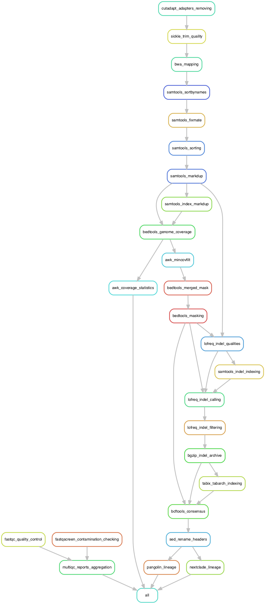

# GeVarLi: GEnome assembly, VARiant calling and LIneage assignation #


 | Catalina (10.15.7) | Big Sure (11.6.3) | Monterey (12.2.0)/E6055C?icon=apple&label&list=|&scale=0.9>)


## ~ ABOUT ~ ##

GeVarLi	is a bioinformatic pipeline used for SARS-CoV-2	genomes assembly from Illumina short reads with tiled libraries sequencing.  
Writed for **[AFROSCREEN](https://www.afroscreen.org/)** project. 

### Genomic sequencing, a public health tool ###
The establishment of a surveillance and sequencing network is an essential public health tool for detecting and containing pathogens with epidemic potential. Genomic sequencing makes it possible to identify pathogens, monitor the emergence and impact of variants, and adapt public health policies accordingly.

The Covid-19 epidemic has highlighted the disparities that remain between continents in terms of surveillance and sequencing systems. At the end of October 2021, of the 4,600,000 sequences shared on the public and free GISAID tool worldwide, only 49,000 came from the African continent, i.e. less than 1% of the cases of Covid-19 diagnosed on this continent.

### Features ###
- Control reads quality (_multiQC html report_) and clean it  
- Align reads (_bam files_), variants calling (_vcf files_) and genome coverage statistics  
- Consensus sequences (_fasta file_)  
- Nextclade and Pangolin classifications  

### Version ###
This is the **macOSX** version (_specific conda environements_) v.2022.04.25  

### Rulegraph ###
  

## ~ INSTALLATIONS ~ ##

### Conda _(required)_ ###
Install **Conda** _(i.e. Miniconda3 with Python 3.9 on MacOSX-64-bit)_: [Latest Miniconda Installer](https://docs.conda.io/en/latest/miniconda.html#latest-miniconda-installer-links)  
_Follow the screen prompt instructions_  
```shell
curl https://repo.anaconda.com/miniconda/Miniconda3-latest-MacOSX-x86_64.sh -o ./Miniconda3-latest-MacOSX-x86_64.sh 
bash ./Miniconda3-latest-MacOSX-x86_64.sh
rm -f ./Miniconda3-latest-MacOSX-x86_64.sh
```
- Please, **restart** now your shell (i.e. close and open a new terminal window)

### Snakemake _(required)_ ###
Install **Snakemake** _(i.e. v.6.12.1)_ using Conda  
_Follow the screen prompt instructions_  
```shell
conda install -c conda-forge mamba --yes
mamba install -c bioconda rename --yes
mamba install -c conda-forge -c bioconda snakemake=6.12.1 --yes
```

### GeVarLi ###
Clone _(HTTPS or SSH)_ the [GeVarLi_macOSX](https://forge.ird.fr/transvihmi/GeVarLi_macOSX) repository on GitLab _(ID: 399)_:

#### HTTPS ####
If you want to authenticate each time you perform an operation between your computer and GitLab
```shell
git clone https://forge.ird.fr/transvihmi/GeVarLi_macOSX.git
cd ./GeVarLi_macOSX/
```

#### SSH ####
If you want to authenticate only one time _(follow instructions: [SSH documentation](https://docs.gitlab.com/ee/ssh/index.html))_
```shell
git clone git@forge.ird.fr:transvihmi/GeVarLi_macOSX.git
cd ./GeVarLi_macOSX/
```

Difference between **Download** and **Clone**:  
- To create a copy of a remote repository’s files on your computer, you can either **Download** or **Clone** the repository  
- If you download it, you **cannot sync** the repository with the remote repository on GitLab  
- Cloning a repository is the same as downloading, except it preserves the Git connection with the remote repository  
- You can then modify the files locally and upload the changes to the remote repository on GitLab  
- You can then **update** the files locally and download the changes from the remote repository on GitLab  
```shell
cd ./GeVarLi_macOSX/
git pull --verbose
```

## ~ USAGE ~ ##

1. Copy your **paired-end** reads in **.fastq.gz** format files into: **./resources/reads/** directory
2. Execute the **GeVarLi.sh** bash script to run the GeVarLi pipeline
    - with a **Double-click** on it _(if default app for .sh files is Terminal.app)_
	- with a **Right-click** > **Open with** > **Terminal.app**
	- with **CLI** from a terminal:
```shell
bash ./GeVarLi_macOSX/GeVarLi.sh
```
Yours analyzes will start with default configuration settings  

_Option-1: Edit **config.yaml** file in **./config/** directory_  
_Option-2: Edit **fastq-screen.conf** file in **./config/** directory_  


## ~ RESULTS ~ ##

Yours results are available in **./results/** directory, as follow:  
_(file names keep track which tools / params was used: \<**sample**\>\_\<**aligner**\>\_\<**mincov**\>)_  

### root ###
This is the main results :   

- **All_consensus_sequences.fasta**: all consensus sequences, in _fasta_ format
- **All_genome_coverages.tsv**: all genome coverages, in _tsv_ format
- **All_nextclade_lineages.tsv**: all nextclade lineage reports, in _tsv_ format
- **All_pangolin_lineages.tsv**: all pangolin lineage reports, in _tsv_ format
- **All_readsQC_reports.html**: all reads quality reports from MultiQC, in _html_ format

### 00_Quality_Control ###
- **fastq-screen**: raw reads putative contaminations reports for each samples, in _html_, _png_ and _txt_ formats 
- **fastqc**: raw reads quality reports for each samples, in _html_ and _zip_ formats
- **multiqc**: fastq-screen and fastqc results agregation report for all samples, in _html_ format

### 01_Trimming ###
- **sickle/ directory**: paired reads, without adapters and quality trimmed, in _fastq.gz_ format
- _cutadapt/ directory: paired reads, without adapters (default config: tempdir, removed, save disk usage)_

### 02_Mapping ###
- **markdup.bam**: read alignments, in _bam_ format _(can be visualized in, i.e. IGV)_
- **markdup.bai**: bam indexes _bai_ use in i.e. IGV with _./resources/genomes/SARS-CoV-2_Wuhan-WIV04_2019.fasta_
- _mapped.sam_: (default config: tempdir, removed, save disk usage)_
- _sortbynames.bam_: (default config: tempdir, removed, save disk usage)_
- _fixmate.bam_: (default config: tempdir, removed, save disk usage)_
- _sorted.bam_: (default config: tempdir, removed, save disk usage)_

### 03_Coverage ###
- **coverage-stats.tsv**: information about genome coverage
    - **mean_depth**: mean coverage depth across all genome reference sequence
	- **standard_deviation**: standard deviation for mean_depth
	- **cov_percent_@nX**: genome reference coverage percentage at at-least n X of depth

### 04_Variants ###
- **maskedref.fasta**: reference sequence, masked for low coverage regions, in _fasta_ format
- **maskedref.fasta.fai**: reference sequence indexes, masked for low coverages regions, in _fai_ format
- **indelqual.bam**: read alignments with indel qualities, in _bam_ format _(can be visualized in, i.e. IGV)_
- **indelqual.bai**: bam indexes _bai_ use in i.e. IGV with _./results/04_Variants/maskedref.fasta_
- **variantcall.vcf**: SNVs and Indels calling in _vcf_ format
- **variantfilt.vcf**: SNVs and Indels passing filters, in _vcf_ format
- **variantfilt.vcf.bgz**: SNVs and Indels passing filters archive, in _vcf.bgz_ format
- **variantfilt.vcf.bgz.tbi**: SNVs and Indels passing filters archive indexed, in _vcf.bgz.tbi_ format

### 05_Consensus ###
- **consensus.fasta**: consensus sequence, without low coverage regions, in _fasta_ format

### 06_Lineages ###
- **pangolin-report.csv**: pangolin and scorpio lineage assignation and quality report, in _csv_ format
- **nextclade-report.tsv**: nextclade lineage assignation and quality report, in _tsv_ format
- **nextclade-alignement/ directory**:
    - **consensus.aligned.fasta**: aligned sequences, in _fasta_ format
    - **consensus.insertions.csv**: stripped insertions data, in _csv_ format
    - **consensus.errors.csv**: errors and warnings occurred during processing, in _csv_ format
    - **consensus.gene.\<gene\>.fasta**: peptide sequences for genes E, M, N, S and ORFs 1a, 1b, 3a, 6, 7a, 7b, 8, 9b

### 10_graphs ###
- **dag**: directed acyclic graph of jobs, in _pdf_ and _png_ formats
- **rulegraph**: dependency graph of rules, in _pdf_ and _png_ formats  
_(less crowded than above DAG of jobs, but also show less information)_  
- **filegraph**: dependency graph of rules with their input and output files in the dot language, in _pdf_ and _png_ formats  
_(an intermediate solution between above DAG of jobs and the rule graph)_  

### 11_Reports ###
- All _non-empty_ **log** for each tool and each sample
- files_summary.txt: summary of all files created by the workflow, in _txt_ format  
_(columns: filename, modification time, rule version, status, plan)_


## ~ CONFIGURATION ~ ##

If you want see or edit default settings in **config.yaml** file in **./config/** directory  

### Resources ###
Edit to match your hardware configuration  
- **cpus**: for tools that can _(i.e. bwa)_ could be use at most n cpus to run in parallel _(default config: '4')_  
_**Note**: snakemake (if launch with default bash script) will always use all cpus to parallelize jobs_
- **mem_gb**: for tools that can _(i.e. samtools)_ limit its use of memory to max n Gb _(default config: '4' Gb)_
- **tmpdir**: for tools that can _(i.e. pangolin)_ specify where you want the temp stuff _(default config: '$TMPDIR')_

### Environments ###
Edit if you change some environments _(i.e. new version)_ in ./workflow/envs/tools-version.yaml files

### Aligner ###
You can choose to align your reads using either **BWA** or **Bowtie2** or both tools  
To select one or both, de/comment (#) as you wish:

- **bwa**: faster _(default config)_
- **bowtie2**: slower, sensitivity requiried could be set _(see below "Bowtie2" options)_

### Consensus ###
- **reference**: reference sequence path used for genome assmbling _(default config: 'SARS-CoV-2\_Wuhan-WIV04\_2019')_
- **mincov**: minimum coverage for masking to low covered regions in final consensus sequence _(default config: '10')_

### Variant ###
- **covmin**: minimum coverage allowed for SNVs and InDels filtering, if < 1 = off _(default config: '10' (INT))_
- **afmin**: minimum allele frequency allowed for SNVs and InDels filtering, if < 1 = off _(default config: '0.2' (FLOAT))_

### BWA ###
- **index**: reference index path for bwa _(default config: 'SARS-CoV-2_Wuhan-WIV04_2019')_

### Bowtie2 ###
- **index**: reference index path for bowtie2 _(default config: 'SARS-CoV-2\_Wuhan-WIV04\_2019')_
- **sensitivity**: preset for bowtie2 sensitivity _(default config: '--sensitive')_

### Sickle-trim ###
- **command**: Pipeline wait for paired-end reads _(default config: 'pe')_
- **encoding**: If your data are from recent Illumina run, let 'sanger' _(default config: 'sanger')_
- **quality**: [Q-phred score](https://en.wikipedia.org/wiki/Phred_quality_score) limit _(default config: '30')_
- **length**: read length limit, after trim _(default config: '25')_

### Cutadapt ###
- **length**: discard reads shorter than length, after trim _(default config: '25')_
- **kits**: sequence of an adapter ligated to the 3' end of the first read _(default config: 'truseq', 'nextera' and 'small' Illumina kits)  

### Fastq-Screen ###
- **config**: path to the fastq-screen configuration file _(default config: ./config/fastq-screen.conf)_
- **subset**: do not use the whole sequence file, but create a temporary dataset of this specified number of read _(default config: '1000')_
- **aligner**: specify the aligner to use for the mapping. Valid arguments are 'bowtie', bowtie2' or 'bwa' _(default config: 'bwa')_

#### fastq-screen.conf ####
- **databases**: enables you to configure multiple genomes databases _(aligner index files)_ to search against

### Glossary ###
- **BAM**: Binary Alignment Map
- **BAI**: BAM Indexes
- **FASTA**: Fast-All
- **FASTQ**: FASTA with Quality
- **FAI**: FASTA Indexes
- **SAM**: Sequence Alignment Map

### Directories tree structure ###
```shell
🖥️️  GeVarLi.sh
📚 README.md
📂 visuals/
 └── 📈 rulegraph.png
📂 config/
 ├── ⚙️ config.yaml
 └── ⚙️ fastq-screen.conf
📂 resources/
 ├── 📂 genomes/
 │    └── 🧬 SARS-CoV-2_Wuhan-WIV04_2019.fasta
 ├── 📂 indexes/
 │    ├── 📂 bowtie2/
 │    │    └── 🗂️ SARS-CoV-2_Wuhan-WIV04_2019
 │    └── 📂 bwa/
 │         ├── 🗂️ SARS-CoV-2_Wuhan-WIV04_2019
 │         ├── 🗂️ Adapters
 │         ├── 🗂️ Ebola_ZEBOV
 │         ├── 🗂️ Echerichia_coli_U00096
 │         ├── 🗂️ HIV_HXB2
 │         ├── 🗂️ Phi-X174
 │         └── 🗂️ UniVec_wo_phi-X174
 ├── 📂 nextclade/
 │    └── 📂 sars-cov-2/
 │         ├── 🌍 genemap.gff
 │         ├── 🧪 primers.csv
 │         ├── ✅ qc.json
 │         ├── 🦠 reference.fasta
 │         ├── 🧬 sequences.fasta
 │         ├── 🏷️  tag.json
 │         └── 🌳 tree.json
 └── 📂 reads/  
      ├── 🛡️ .gitkeep
      ├── 📦 Sample-A_R1.fastq.gz
      ├── 📦 Sample-A_R2.fastq.gz
	  ├── 📦 Sample-B_R1.fastq.gz
      └── 📦 Sample-B_R2.fastq.gz
📂 workflow/
 ├── 📂 envs/
 │    ├── 🍜 bcftools-1.14.yaml
 │    ├── 🍜 bedtools-2.30.0.yaml
 │    ├── 🍜 bowtie2-2.4.4.yaml
 │    ├── 🍜 bwa-0.7.17.yaml
 │    ├── 🍜 cutadapt-3.5.yaml
 │    ├── 🍜 fastq-screen-0.14.0.yam
 │    ├── 🍜 fastqc-0.11.9.yaml
 │    ├── 🍜 gawk-5.1.0.yaml
 │    ├── 🍜 lofreq-2.1.5.yaml
 │    ├── 🍜 multiqc-1.11.yaml
 │    ├── 🍜 nextclade-1.11.0.yaml
 │    ├── 🍜 pangolin-3.1.17.yaml
 │    ├── 🍜 samtools-1.14.yaml
 │    └── 🍜 sickle-trim-1.33.yaml
 └── 📂 rules/
      └── 📜 gevarli.smk
```

## ~ SUPPORT ~ ##
1. Read The Fabulous Manual!
2. Read de Awsome Wiki! (todo...)
3. Create a new issue: Issues > New issue > Describe your issue
4. Send an email to [nicolas.fernandez@ird.fr](url)

## ~ ROADMAP ~ ##
- Add a wiki!  

## ~ AUTHORS & ACKNOWLEDGMENTS ~ ##
- Nicolas Fernandez (Developer and Maintener)  
- Christelle Butel (Reporter, User-addict, Fetaures inspiration source)  
- Eddy Kinganda-Lusamaki (who ask me to find a free open source unix friendly pipeline, now we have Eddy)  

## ~ CONTRIBUTING ~ ##
Open to contributions!  
Testing code, finding issues, asking for update, proposing new features...  
Use Git tools to share!  

## ~ PROJECT STATUS ~ ##
This project is **regularly update** and **actively maintened**  
However, you can be volunteer to step in as **developer** or **maintainer**  

For information about main git roles:  
- **Guests** are _not active contributors_ in private projects, they can only see, and leave comments and issues  
- **Reporters** are _read-only contributors_, they can't write to the repository, but can on issues  
- **Developers** are _direct contributors_, they have access to everything to go from idea to production  
_Unless something has been explicitly restricted_  
- **Maintainers** are _super-developers_, they are able to push to master, deploy to production  
_This role is often held by maintainers and engineering managers_  
- **Owners** are essentially _group-admins_, they can give access to groups and have destructive capabilities  

## ~ LICENSE ~ ##
[GPLv3](https://www.gnu.org/licenses/gpl-3.0.html)  

## ~ REFERENCES ~ ##
**Sustainable data analysis with Snakemake**  
Felix Mölder, Kim Philipp Jablonski, Brice Letcher, Michael B. Hall, Christopher H. Tomkins-Tinch, Vanessa Sochat, Jan Forster, Soohyun Lee, Sven O. Twardziok, Alexander Kanitz, Andreas Wilm, Manuel Holtgrewe, Sven Rahmann, Sven Nahnsen, Johannes Köster  
_F1000Research (2021)_  
**DOI**: [https://doi.org/10.12688/f1000research.29032.2](https://doi.org/10.12688/f1000research.29032.2)  
**Publication**: [https://f1000research.com/articles/10-33/v1](https://f1000research.com/articles/10-33/v1)  
**Source code**: [https://github.com/snakemake/snakemake](https://github.com/snakemake/snakemake)  
**Documentation**: [https://snakemake.readthedocs.io/en/stable/index.html](https://snakemake.readthedocs.io/en/stable/index.html)  

**Anaconda Software Distribution**  
Team  
_Computer software (2016)_  
**DOI**: []()  
**Publication**: [https://www.anaconda.com](https://www.anaconda.com)  
**Source code**: [https://github.com/snakemake/snakemake](https://github.com/snakemake/snakemake) (conda)  
**Documentation**: [https://snakemake.readthedocs.io/en/stable/index.html](https://snakemake.readthedocs.io/en/stable/index.html) (conda)  
**Source code**: [https://github.com/mamba-org/mamba](https://github.com/mamba-org/mamba) (mamba) 
**Documentation**: [https://mamba.readthedocs.io/en/latest/index.html](https://mamba.readthedocs.io/en/latest/index.html) (mamba)  

**HAVoC, a bioinformatic pipeline for reference-based consensus assembly and lineage assignment for SARS-CoV-2 sequences**  
Phuoc Thien Truong Nguyen, Ilya Plyusnin, Tarja Sironen, Olli Vapalahti, Ravi Kant & Teemu Smura  
_BMC Bioinformatics volume 22, Article number: 373 (2021)_  
**DOI**: [https://doi.org/10.1186/s12859-021-04294-2](https://doi.org/10.1186/s12859-021-04294-2)  
**Publication**: [https://bmcbioinformatics.biomedcentral.com/articles/10.1186/s12859-021-04294-2#Bib1](https://bmcbioinformatics.biomedcentral.com/articles/10.1186/s12859-021-04294-2#Bib1)  
**Source code**: [https://bitbucket.org/auto_cov_pipeline/havoc](https://bitbucket.org/auto_cov_pipeline/havoc)  
**Documentation**: [https://www2.helsinki.fi/en/projects/havoc](https://www2.helsinki.fi/en/projects/havoc)  

**Nextclade: clade assignment, mutation calling and quality control for viral genomes**  
Ivan Aksamentov, Cornelius Roemer, Emma B. Hodcroft and Richard A. Neher  
_The Journal of Open Source Software_  
**DOI**: [https://doi.org/10.21105/joss.03773](https://doi.org/10.21105/joss.03773)  
**Publication**: [https://joss.theoj.org/papers/10.21105/joss.03773)(https://joss.theoj.org/papers/10.21105/joss.03773)  
**Source code**: [https://github.com/nextstrain/nextclade](https://github.com/nextstrain/nextclade)  
**Documentation**: [https://clades.nextstrain.org](https://clades.nextstrain.org)  

**Assignment of epidemiological lineages in an emerging pandemic using the pangolin tool**  
Áine O’Toole, Emily Scher, Anthony Underwood, Ben Jackson, Verity Hill, John T McCrone, Rachel Colquhoun, Chris Ruis, Khalil Abu-Dahab, Ben Taylor, Corin Yeats, Louis du Plessis, Daniel Maloney, Nathan Medd, Stephen W Attwood, David M Aanensen, Edward C Holmes, Oliver G Pybus and Andrew Rambaut  
_Virus Evolution, Volume 7, Issue 2 (2021)_  
**DOI**: [https://doi.org/10.1093/ve/veab064](https://doi.org/10.1093/ve/veab064)  
**Publication**: [https://academic.oup.com/ve/article/7/2/veab064/6315289](https://academic.oup.com/ve/article/7/2/veab064/6315289)  
**Source code**: [https://github.com/cov-lineages/pangolin](https://github.com/cov-lineages/pangolin) _(pangolin)_  
**Source code**: [https://github.com/cov-lineages/scorpio](https://github.com/cov-lineages/scorpio) _(scorpio)_  
**Documentation**: [https://cov-lineages.org/index.html](https://cov-lineages.org/index.html)  

**Tabix: fast retrieval of sequence features from generic TAB-delimited files**  
Heng Li  
_Bioinformatics, Volume 27, Issue 5 (2011)_  
**DOI**: [https://doi.org/10.1093/bioinformatics/btq671](https://doi.org/10.1093/bioinformatics/btq671)  
**Publication**: [https://www.ncbi.nlm.nih.gov/pmc/articles/PMC3042176/](https://www.ncbi.nlm.nih.gov/pmc/articles/PMC3042176/)  
**Source code**: [https://github.com/samtools/samtools](https://github.com/samtools/samtools)  
**Documentation**: [http://samtools.sourceforge.net](http://samtools.sourceforge.net)  

**LoFreq: a sequence-quality aware, ultra-sensitive variant caller for uncovering cell-population heterogeneity from high-throughput sequencing datasets**  
Andreas Wilm, Pauline Poh Kim Aw, Denis Bertrand, Grace Hui Ting Yeo, Swee Hoe Ong, Chang Hua Wong, Chiea Chuen Khor, Rosemary Petric, Martin Lloyd Hibberd and Niranjan Nagarajan  
_Nucleic Acids Research, Volume 40, Issue 22 (2012)_  
**DOI**: [https://doi.org/10.1093/nar/gks918](https://doi.org/10.1093/nar/gks918)  
**Publication**: [https://pubmed.ncbi.nlm.nih.gov/23066108/](https://pubmed.ncbi.nlm.nih.gov/23066108/)  
**Source code**: [https://gitlab.com/treangenlab/lofreq](https://gitlab.com/treangenlab/lofreq) _(v2 used)_  
**Source code**: [https://github.com/andreas-wilm/lofreq3](https://github.com/andreas-wilm/lofreq3) _(see also v3 in Nim)_  
**Documentation**: [https://csb5.github.io/lofreq](https://csb5.github.io/lofreq)  

**The AWK Programming Language**  
Al Aho, Brian Kernighan and Peter Weinberger  
_Addison-Wesley (1988)_  
**ISBN**: [https://www.biblio.com/9780201079814](https://www.biblio.com/9780201079814)  
**Publication**: []()  
**Source code**: [https://github.com/onetrueawk/awk](https://github.com/onetrueawk/awk)  
**Documentation**: [https://www.gnu.org/software/gawk/manual/gawk.html](https://www.gnu.org/software/gawk/manual/gawk.html)  

**BEDTools: a flexible suite of utilities for comparing genomic features**  
Aaron R. Quinlan and Ira M. Hall  
_Bioinformatics, Volume 26, Issue 6 (2010)_  
**DOI**: [https://doi.org/10.1093/bioinformatics/btq033](https://doi.org/10.1093/bioinformatics/btq033)  
**Publication**: [https://academic.oup.com/bioinformatics/article/26/6/841/244688](https://academic.oup.com/bioinformatics/article/26/6/841/244688)  
**Source code**: [https://github.com/arq5x/bedtools2](https://github.com/arq5x/bedtools2)  
**Documentation**: [https://bedtools.readthedocs.io/en/latest/](https://bedtools.readthedocs.io/en/latest/)  

**Twelve years of SAMtools and BCFtools**  
Petr Danecek, James K Bonfield, Jennifer Liddle, John Marshall, Valeriu Ohan, Martin O Pollard, Andrew Whitwham, Thomas Keane, Shane A McCarthy, Robert M Davies and Heng Li  
_GigaScience, Volume 10, Issue 2 (2021)_  
**DOI**: [https://doi.org/10.1093/gigascience/giab008](https://doi.org/10.1093/gigascience/giab008)  
**Publication**: [https://academic.oup.com/gigascience/article/10/2/giab008/6137722](https://academic.oup.com/gigascience/article/10/2/giab008/6137722)  
**Source code**: [https://github.com/samtools/samtools](https://github.com/samtools/samtools)  
**Documentation**: [http://samtools.sourceforge.net](http://samtools.sourceforge.net)  

**Fast and accurate short read alignment with Burrows-Wheeler Transform**  
Heng Li and Richard Durbin  
_Bioinformatics, Volume 25, Aricle 1754-60 (2009)_  
**DOI**: [https://doi.org/10.1093/bioinformatics/btp324](https://doi.org/10.1093/bioinformatics/btp324)  
**Publication**: [https://pubmed.ncbi.nlm.nih.gov/19451168@](https://pubmed.ncbi.nlm.nih.gov/19451168)  
**Source code**: [https://github.com/lh3/bwa](https://github.com/lh3/bwa)  
**Documentation**: [http://bio-bwa.sourceforge.net](http://bio-bwa.sourceforge.net)  

**Sickle: A sliding-window, adaptive, quality-based trimming tool for FastQ files**  
Joshi NA and Fass JN  
_(2011)  
**DOI**: [https://doi.org/](https://doi.org/)  
**Publication**: []()  
**Source code**: [https://github.com/najoshi/sickle](https://github.com/najoshi/sickle)  
**Documentation**: []()  

**Cutadapt Removes Adapter Sequences From High-Throughput Sequencing Reads**  
Marcel Martin  
_EMBnet Journal, Volume 17, Article 1 (2011)  
**DOI**: [https://doi.org/10.14806/ej.17.1.200](https://doi.org/10.14806/ej.17.1.200)  
**Publication**: [http://journal.embnet.org/index.php/embnetjournal/article/view/200](http://journal.embnet.org/index.php/embnetjournal/article/view/200)  
**Source code**: [https://github.com/marcelm/cutadapt](https://github.com/marcelm/cutadapt)  
**Documentation**: [https://cutadapt.readthedocs.io/en/stable/](https://cutadapt.readthedocs.io/en/stable)  

**MultiQC: summarize analysis results for multiple tools and samples in a single report**  
Philip Ewels, Måns Magnusson, Sverker Lundin and Max Käller  
_Bioinformatics, Volume 32, Issue 19 (2016)_  
**DOI**: [https://doi.org/10.1093/bioinformatics/btw354](https://doi.org/10.1093/bioinformatics/btw354)  
**Publication**: [https://academic.oup.com/bioinformatics/article/32/19/3047/2196507](https://academic.oup.com/bioinformatics/article/32/19/3047/2196507)  
**Source code**: [https://github.com/ewels/MultiQC](https://github.com/ewels/MultiQC)  
**Documentation**: [https://multiqc.info](https://multiqc.info)  

**FastQ Screen: A tool for multi-genome mapping and quality control**  
Wingett SW and Andrews S  
_F1000Research (2018)_  
**DOI**: [https://doi.org/10.12688/f1000research.15931.2](https://doi.org/10.12688/f1000research.15931.2)  
**Publication**: [https://f1000research.com/articles/7-1338/v2](https://f1000research.com/articles/7-1338/v2)  
**Source code**: [https://github.com/StevenWingett/FastQ-Screen](https://github.com/StevenWingett/FastQ-Screen)  
**Documentation**: [https://www.bioinformatics.babraham.ac.uk/projects/fastq_screen](https://www.bioinformatics.babraham.ac.uk/projects/fastq_screen)  

**FastQC: A quality control tool for high throughput sequence data**  
Simon Andrews  
_Online (2010)_  
**DOI**: [https://doi.org/](https://doi.org/)  
**Publication**: []()  
**Source code**: [https://github.com/s-andrews/FastQC](https://github.com/s-andrews/FastQC)  
**Documentation**: [https://www.bioinformatics.babraham.ac.uk/projects/fastqc](https://www.bioinformatics.babraham.ac.uk/projects/fastqc)  
